#  {.tabset .tabset-fade .tabset-pills}

## About this project

**Why identify plumes and blooms?** Cyanobacteria blooms are one of the most significant management challenges in the Great Lakes today. Recurring blooms of varying toxicity are commonly observed in four of the Great Lakes, and the fifth, Lake Superior, has experienced intermittent nearshore blooms since 2012. The recent advent of cyanobacterial blooms in Lake Superior is disconcerting, given the highly valued, pristine water quality of the large lake. Many fear the appearance of blooms portend a very different future for Lake Superior. As a public resource, the coastal water quality of Lake Superior has tremendous economic, public health, and environmental value, and therefore, preventing cyanobacterial blooms in Lake Superior is a high-priority management challenge.

Lake Superior is a large lake, and relying on human observations of blooms restricts observations to near-shore locations. Remote sensing has the potential to catalog spatial and temporal extent of surface blooms. In this project, we are attempting to use optical imagery from Lake Superior to delineate surface plumes (sediment) and blooms (algae). It is likely that these two surface features occur at the same time (i.e a rainstorm may lead to a sediment plume from a river and subsequently an algal boom).

To train computer algorithms to detect these features in satellite images we need a training dataset. That's where we need your help! In this exercise, we ask you to participate in identifying changes in surface conditions in the western arm of Lake Superior. All you need is a computer and your eyes.

**It's my first time here &rarr;** We will be using Google Earth Engine (GEE) for this project. Instructions on how to use this software and label satellite imagery are detailed in this tutorial. Click the `Initial setup` tab to begin.

**I've come back to label more &rarr;** If you have completed this workflow before and are returning to contribute more, THANK YOU! Head to `Selecting a mission-date to start labeling` to get going again.

## Initial setup

If this is your first time using GEE and this classification workflow, please follow the tutorial below to have your account and permissions setup appropriately. You should only need to do this step once.

You can also watch the first 2.5 minutes of [this video](https://youtu.be/QXJf9IAF1z4) to visually walk through the setup instructions. Note that the video was originally created for the "GROD workflow", which was the foundation for the workflow here, and you may need to substitute information that is specific for this project.

1.  Sign up for Google Earth Engine: <https://earthengine.google.com/>. If you don't have an affiliation, you can put University of Wisconsin-Madison.
2.  Using your Google account (the same one you made your Google Earth Engine account with), open up your [Google drive](https://drive.google.com/drive/my-drive) and make a new folder in your drive to store data from the project. Please include your name in the name of the folder, ex. 'FirstinitialMiddleinitialLastnameData'

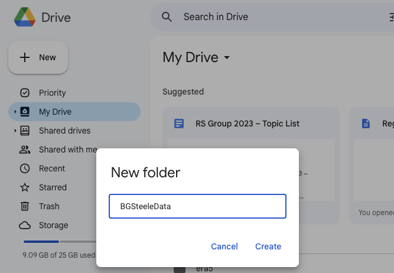{width="400px"}

   3. Create two subdirectories within this new folder - one called 'test-val' and another called 'labels'.

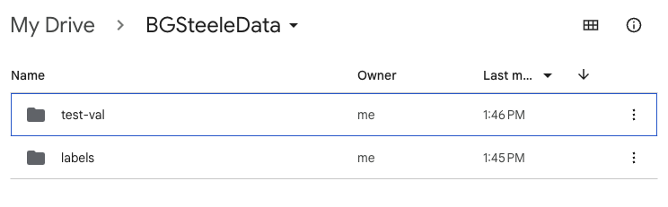{width="400px"}

  

4.  Once the folder is created, please share it with the group. To do this, you can click on the folder and click 'Share.' Next, set General Access to 'Anyone with the link' and 'Editor'. Lastly, click 'copy link,' and paste the link in this [Google Sheets document](https://docs.google.com/spreadsheets/d/1Sk7BuA92Mw4A3_ETialeQ9b1WPXK1TWkfDd8wsvVOFc/edit?usp=sharing) alongside your name and initials.

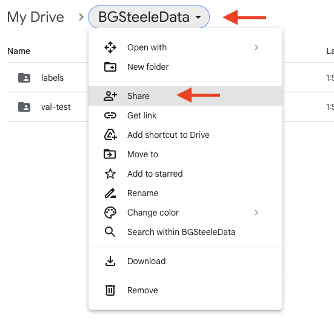{width="400"}

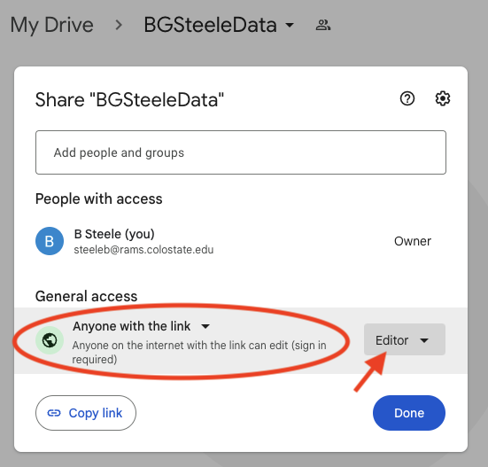{width="400"}

  

## What are we labeling?

For this application, we want to be sure that the pixels that we label are *definitely* the label, which means, if you have a doubt about the class, don't label it. Use the examples and descriptions below to understand the types of pixels we are looking to label in this workflow.

Firstly, please ignore the harbor area - outlined in blue with x's below - when labeling in Tile 1:

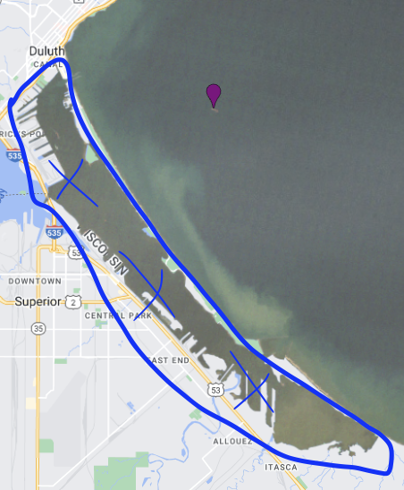{width="400"}

  

`openWater`: clear, dark pixels with no cloud interference or highly dispersed sediment.

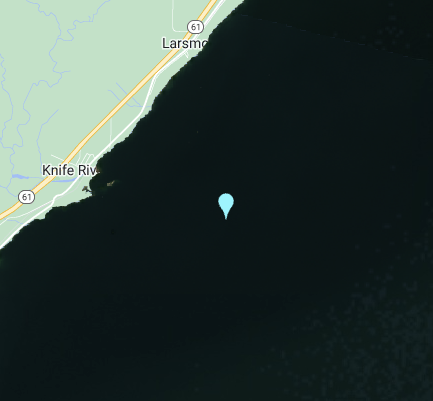{width="400"}

  

`lightNearShoreSediment`: yellow and light brown areas, usually near shore.

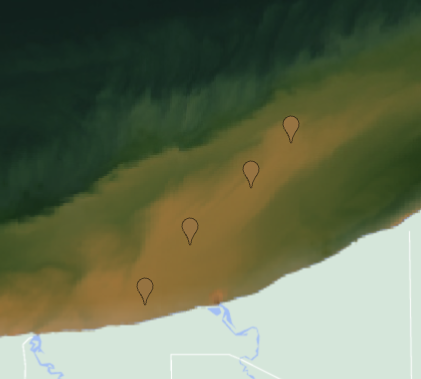{width="400"}

  

`darkNearShoreSediment`: dark brown or red-brown areas, usually near a stream inflow.

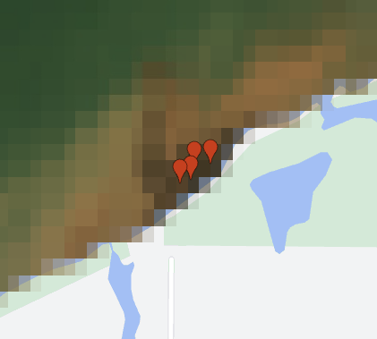{width="400"}

  

`offShoreSediment`: could also be considered dispersed sediment. Green-ish colored areas proximate to near shore sediment. It may often look 'swirled' in the deeper areas of the lake.

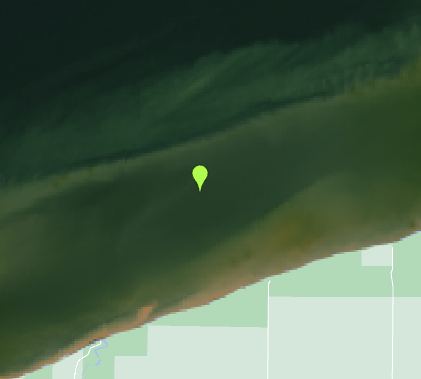{width="400"}

  

`algalBloom`: this class is tricky! It is very hard to discriminate between off shore sediment or dispersed sediment and algal blooms in the imagery provided. In fact, it's so tricky, we don't even have an example for you! Please do use this label if you think you see a bloom.

  

`cloud`: clouds often appear as you would expect: white or wispy. It's totally possible that the *entire* mission-date you have selected is completely cloudy.

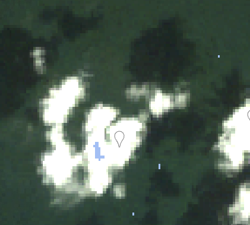{width="400"}

Clouds can look green or even black, too:

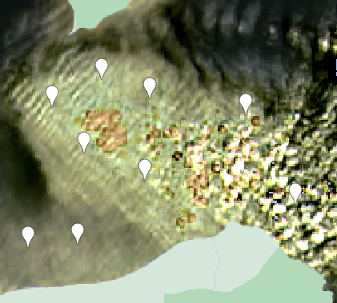{width="400"}

Sometimes the clouds are barely discernible, but the scene looks 'hazy'. In this case, don't label the haze, but do try to avoid it as you label other classes.

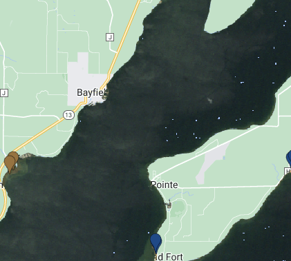{width="400"}

  

`shorelineContamination`: usually dark pixels or yellow-brown pixels that overlap with the shoreline. The purpose of this label is for us to be able to add 'uncertainty' to some machine-inferred labels if they are also proximate to pixels labeled as `shorelineContamination`. Generally speaking, label things that might be 'confusing' for a machine to label because the color is similar to colors of a sediment plume. The easiest way to detect this is to turn on the 'Satellite' baselayer in the top right and toggle the 'Layer 1' option under 'Layers':

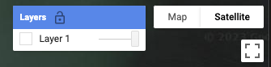{width="400"}

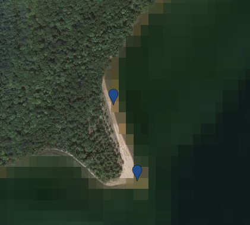{width="400"}

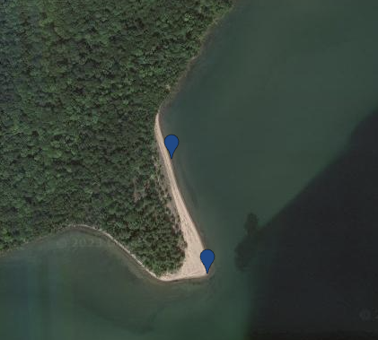{width="400"}

Note, it's very important that you go back to the 'Map' base layer when you aren't labeling shoreline contamination, as it's easy to mistake the 'Satellite' view with the satellite image that you are labeling.

  

`other`: anything else that is present in the image that might be classified as 'other' or 'unknown'. This could be strange image-related issues like this:

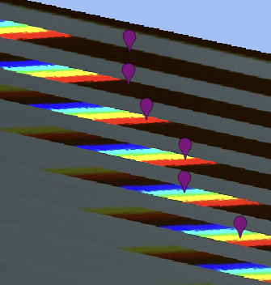{width="400"}

Or boats traveling!

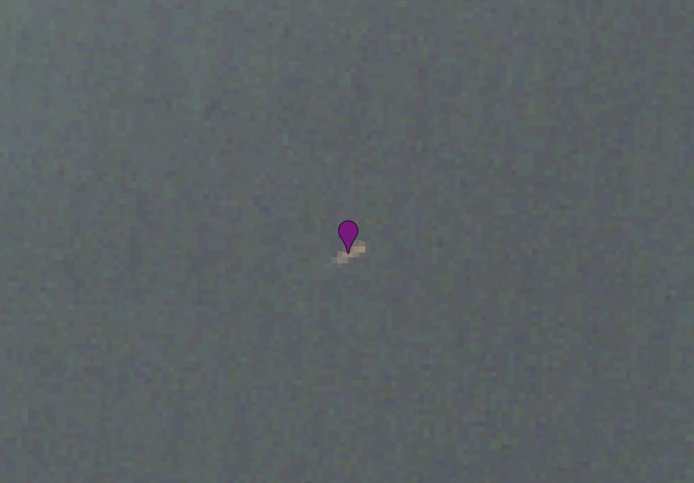{width="400"}

These labels, like shore contamination, help us identify points of uncertainty when segmenting images.

## How to label: Part 1

The purpose of this step is to walk you through how to setup a script in GEE that will open an image for labeling (see `How to label: Part 2` for adding labels to an open image). You will return to this step and start a fresh script for each new set of mission-date images you complete (e.g. a scene from Landsat 7 on 2001-06-10). If this is your first time reading the tutorial, you will be following our "validation" workflow to practice your labeling skills. When you complete the validation workflow, you will return here to start the mission-date labeling workflow. The workflows are almost identical with slight deviations noted in steps 2 and 8 below.

1.  Go to the project [Github page.](https://github.com/rossyndicate/Superior-Plume-Bloom/tree/main/eePlumB/1_user_interface_script)

2.  Copy the appropriate `.js` script.

-   If this is your first time through the tutorial, you will be working with the validation script: [`eePlumB_validation.js`](https://github.com/rossyndicate/Superior-Plume-Bloom/blob/5e9d0cd1ad435aa3bdb2f0d2b41c026c0f57c8ab/eePlumB/1_user_interface_script/eePlumB_validation.js). The purpose of this step is to have you go through the full process of classifying a few images for practice and to provide us with data to see how similarly all our volunteers classify a range of conditions. We hope that the examples below will help guide everyone to classify conditions similarly, but we understand that there will be variation as there is a level of subjectivity in this process.
-   If you have already completed the tutorial once using the validation script, you have made it to the main classification workflow and will be working with the classification script: [`eePlumB.js`](https://github.com/rossyndicate/Superior-Plume-Bloom/blob/5e9d0cd1ad435aa3bdb2f0d2b41c026c0f57c8ab/eePlumB/1_user_interface_script/eePlumB.js)

{width="550px"}

  

3.  Open a blank script file in the [Google Earth Engine editor](https://code.earthengine.google.com/)

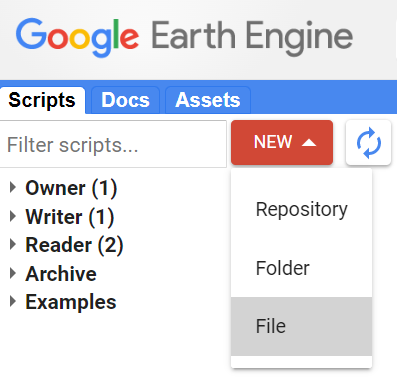{width="200px"}

  

4.  Paste the contents you copied in Step 2 into the blank GEE editor.

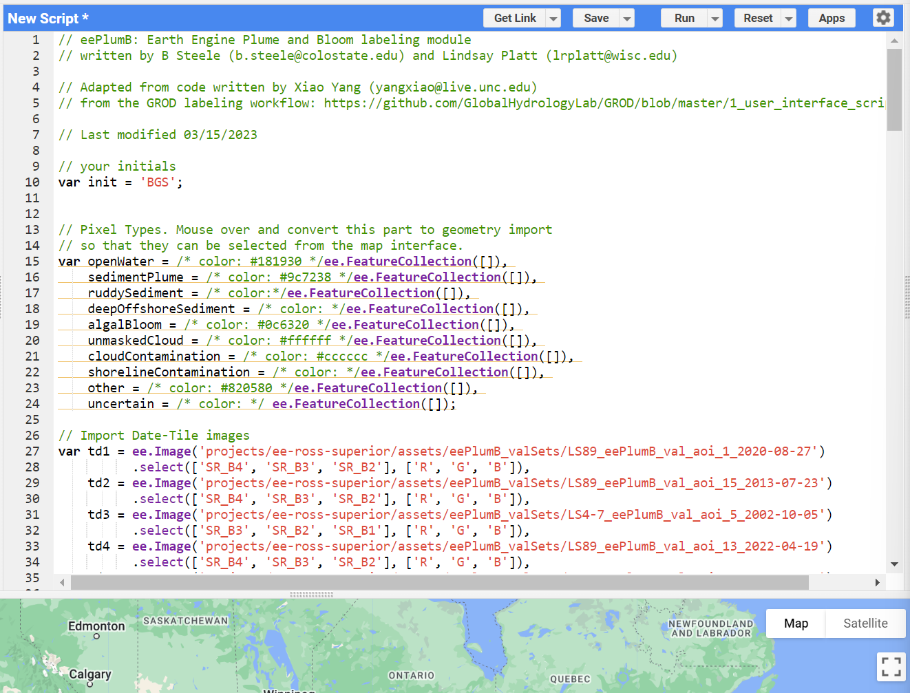{width="550px"}

  

5.  To prepare the feature categories, you will need to convert them to import records. You can do this by hovering over the first few lines of code `var openWater =...` and GEE will prompt you to import these records. Click convert to do so.

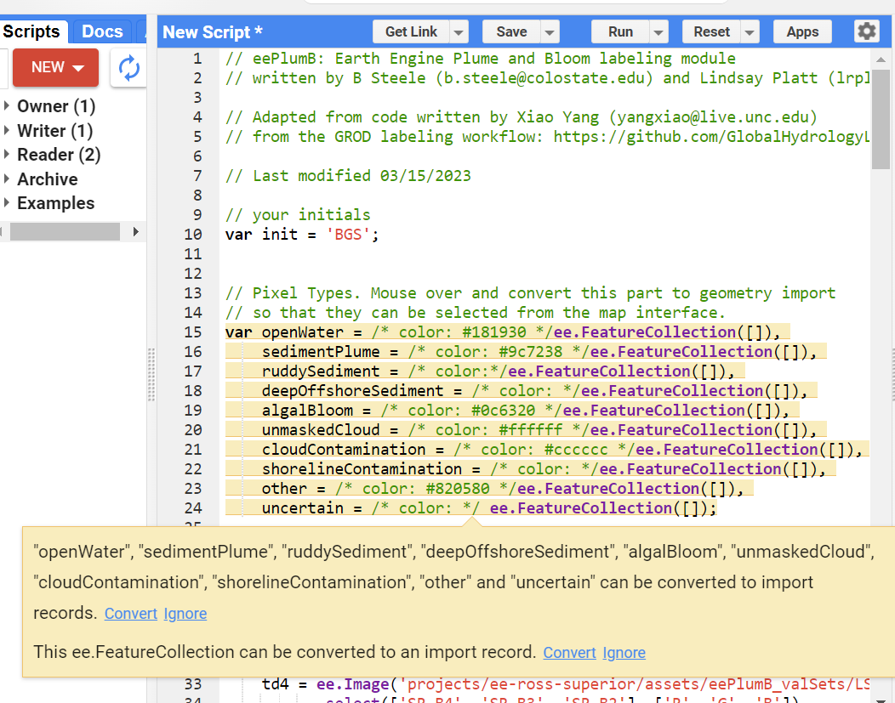{width="550px"}

  

6.  Change the initials at the top of the script to your own and hit the 'Save' button. If you are working on a specific mission-date labeling task (NOT the validation workflow), you should also update the `mission` and `date` variables based on the mission-date you chose in `Selecting a mission-date to start labeling`. 

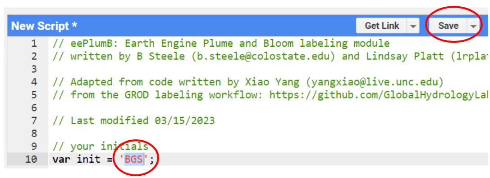{width="350px"}

  

7. If you haven't worked in GEE before, you will be directed to a pop up which will ask you to create your home folder. You won't be able to change this folder name in the future, so we recommend you write your name or a nickname/email and then hit 'continue.'

{width="350px"}

  

8.  Type a name for this script. You will be saving a new script for each unique classification activity. Please take note the name of the file you save as you will need this to go back and continue your work.
    -   If this is your first time through the workflow, you are on the validation step and should name the file `eePlumB_[YOUR INITIALS]_validation`.
    -   If you are working on the actual classification steps, you should name the file `eePlumB_[YOUR INITIALS]_[MISSION]_[DATE]` based on the selected mission-date combination you are currently working through.   
9.  Verify that you are in the script that you just saved, then hit 'Run' at the center top of your screen.

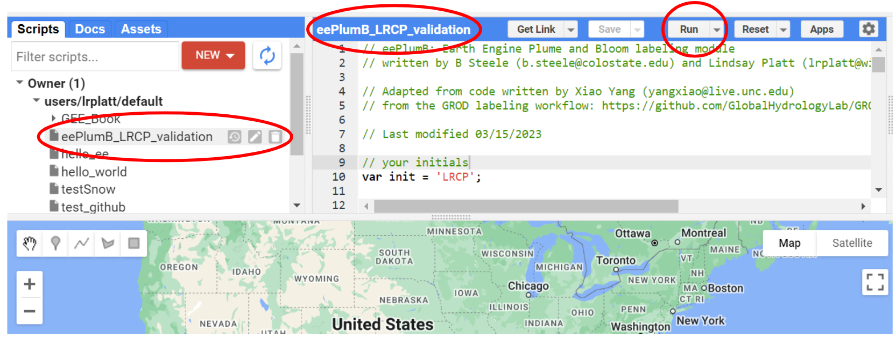{width="350px"}

  

Now that you have the script running, you are ready to add labels. Head to the next section, `How to label: Part 2`!

## How to label: Part 2

The purpose of this step is to teach you how to use our GEE framework to classify images. Hopefully, this section is an easy reference if you need a refresher in the future. Note that this step assumes you have already done `How to label: Part 1` for the current set of images - either for validation or for the specific mission-date you chose during the `Selecting a mission-date to start labeling` step.

### Adding labels

1.  Check that you have the appropriate geometry categories by hovering over `Geometry Imports` in the map area of GEE. When hovering, you should see a list of sediment and bloom types (see image below). If you do not, then you should revisit Part 1 and follow those instructions carefully.

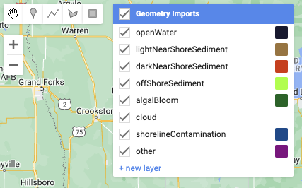{width="350px"}

  

2.  When you see pixels in the image that you would like to label, you will need to click on the top left geometry bar and select the point geometry icon. For each tile that you are working on, you will have to zoom in until you can discern pixels. This is especially important near shore.

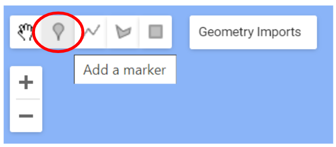{width="300px"}

  

3.  Change the category to the type of pixel that you are labeling by hovering over `openWater` (it just chooses the first category by default) and clicking the name of the category you want. In our example, we'll select 'lightNearShoreSediment'.

4.  Next, click on the map to add a point of this type.

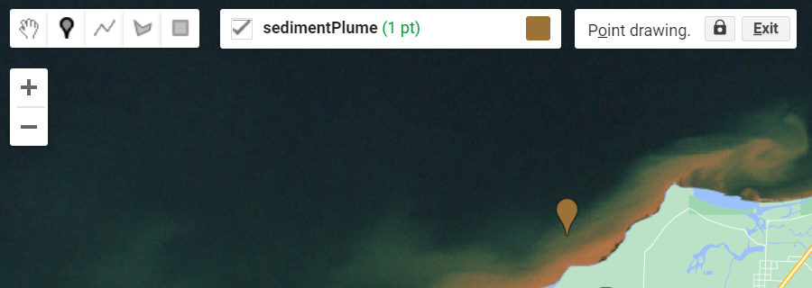{width="550px"}

  

5.  Continue adding points in the current category by clicking the pixel on the map that you want to label. Zoom in or out and scroll (by clicking and dragging) as needed. For each image, label at least 5 pixels for each category you see. Note that you may not see all categories in a given image.

6.  When you have finished labeling a given tile-date, move on to the next tile. If you're not sure if you're done, you can click through each tile to make sure there are markers. There should be 5 tiles for each of the workflows.

   -  In the validation workflow, click 'Tile-Date X' to go to the next image.

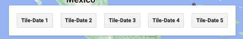{width="300px"}

   -  In the mission-date workflow, click 'Next Tile' to go to the next image.

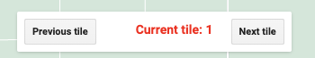{width="300px"}

  

7.  When you are done, click `Exit` next to where it says "Point drawing". If you want to start adding points again, simply go back to Step 2 and repeat.

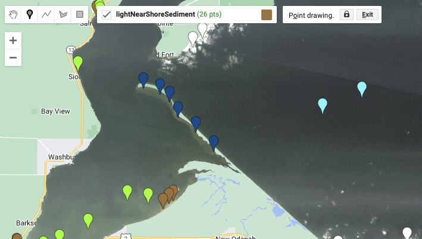{width="550px"}

  

8.  If you're working on an mission-date in the `eePlumB.js` script and need to stop at any point, GEE will save your work and you can start labeling again by clicking on the script you named `eePlumB_[YOUR INITIALS]_[MISSION]_[DATE]` in the upper left hand corner of the GEE code interface:

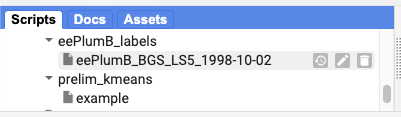{width="550px"}

  

9. If you have at least 5 markers for each class type you see in all of 5 of your tiles, move on to the `Finishing up the labeling` section. This will guide you through saving and exporting your labeled images. 

### Editing

1.  If you have made a mistake, click on the hand icon at the top left-hand corner of the map (see the red circle on the figure below). Next, click on the point you dislike. Then, you can drag to a new location or hit delete to remove the point. If you moved the point, hit `Exit` to stop the editing session.

2.  To resume adding points, go back to Step 2 in the previous section.

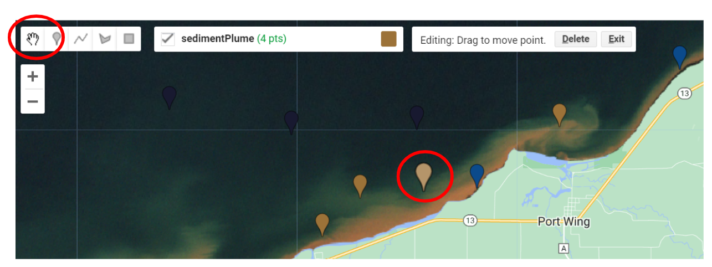{width="550px"}

  

## Finishing up the labeling

When you have completed labeling your image, it's time to export the labels you just created. To do this:

1.  Hit the 'Run' button at the top of the page:

{width="550px"}

  

2.  Navigate to the 'Tasks' tab at the top right of the interface:

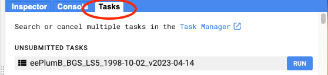{width="550px"}

  

3.  Under 'UNSUBMITTED TASKS' click the blue 'RUN' button.

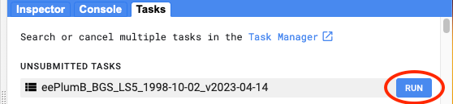{width="550px"}

  

4.  Click 'RUN' at the bottom of the pop-up and accept the default entries. Note that for the validation workflow, the `Drive folder` and `Filename` will look different than the example image below. 

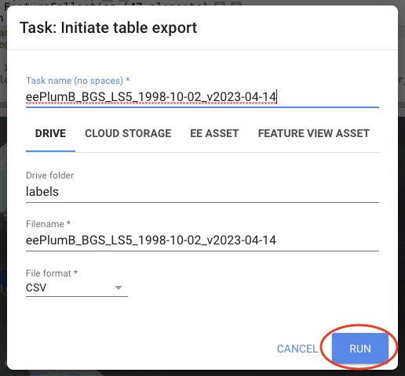{width="550px"}

  

5.  You will now see the task move to 'SUBMITTED TASKS' and a gear will start turning:

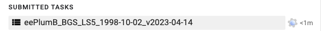{width="550px"}

  

That's all! You do not need to wait for the task to complete to navigate away from this screen or to start a new script.

- If you were completing the validation workflow, check your labeled images against our expectations by heading to [this labeled validation set](https://code.earthengine.google.com/7dd1bca1b1a8f80dd51e045487db9a5a?hideCode=true).  Click 'Run' and click through the Tile-Dates, comparing your labels to ours. Did you use the label classes similarly? Remember, it's less about how many pixels you've labeled and more that the 'quality' of the pixel label is high. If you are happy with your results, you are ready to start labeling for real! Head to the `Selecting a mission-date for labeling` section to pick your own mission-date, and then start back at `How to label: Part 1`.
- If you're ready to label another image, go to `Selecting a mission-date for labeling`, pick a new mission-date, and start again at `How to label: Part 1`. 

## Selecting a mission-date to start labeling

We are hoping to recruit quite a few plume-bloom classifiers to label as many images as we can. The more images we can have amazing citizen scientists like you classify, the better our algorithm can learn from us humans and produce better automated results. We are hoping to label a bunch of dates across a few different "missions" (Landsat 8, Landsat 9, etc), currently totaling over 700 mission-date combinations! 
To help us stay organized and avoid duplication, we have listed all our target mission-date pairs in [this Google Sheet](https://docs.google.com/spreadsheets/d/1g5owPatzZOKuidQccaa5fUGVLnUtHD2na3zjBfQhB-g/edit?usp=sharing). These mission-date pairs have been sorted randomly. As a general rule of thumb, know that Landsat 5 ('mission' = LS5 in the Google sheet) images are 'more difficult' to label because the colors are generally more murky than any other mission. We suggest starting with a LS8 or LS9 image if you are new to satellite imagery.

When you've selected a mission-date to label, put your name and initials in the proper row **when you start** to label the image. This will prevent unnecessary duplication of labeling. When you're finished labeling and have exported the data, add 'yes' to the `finished?` column.

To start labeling your selected mission-date, head to the `How to label: Part 1` section. Note that in steps 6 & 8, you will need to use the row values for the 'mission' and 'date' column from the Google Sheet in addition to editing the script to include your initials (lines 14, 16, and 18) after you've imported the geometry records.

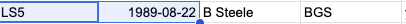{width="450px"}

to enter as your `mission` and `date` variables at the top of the script, as well as, to name your script \`eePlumB\_ [INITIALS] \_ [MISSION] \_ [DATE].js\` in GEE.

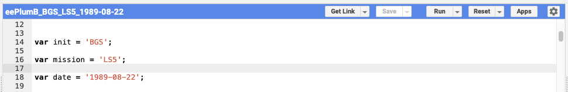{width="450px"}

## User tips

The last two columns of the mission-date Google Sheet lists 'n_PR', which stands for the number of path-rows included in the image. If n_PR = 1, this means that there may be areas of the image that are missing. It's okay if you click through 'tiles' and you don't see imagery - it might look like this, only showing the 'Map' basemap:

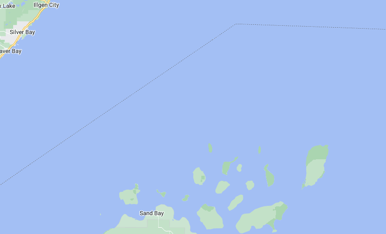{width="450px"}

Also, you might come across mission-dates or tiles that are completely cloud-covered:

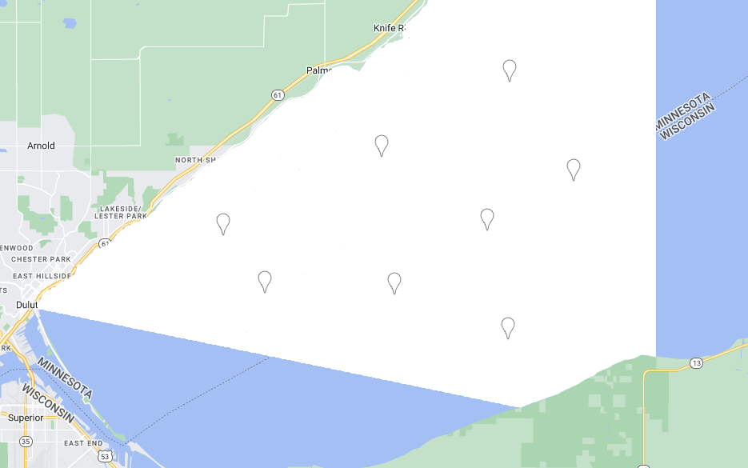{width="450px"}

For these, just label the clouds, and don't worry about any other classes. Still export the data by following the directions under 'Finishing up the labeling'.

### Useful keyboard shortcuts

Here are some useful shortcuts if you are a keyboard rather than mouse person.

{width="450px"}
