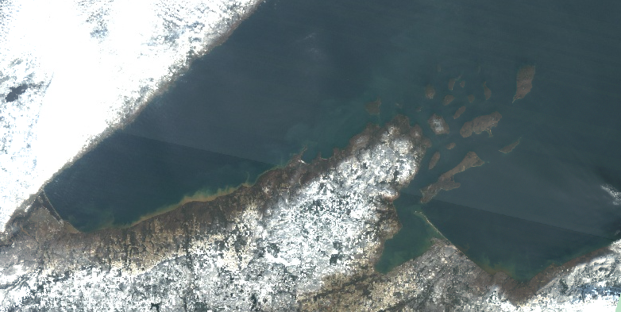
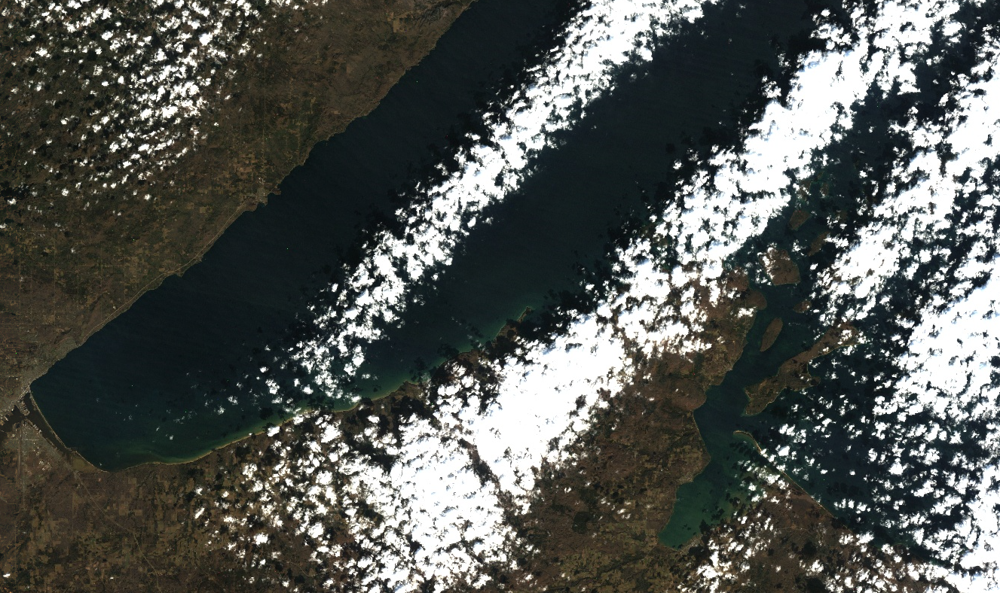
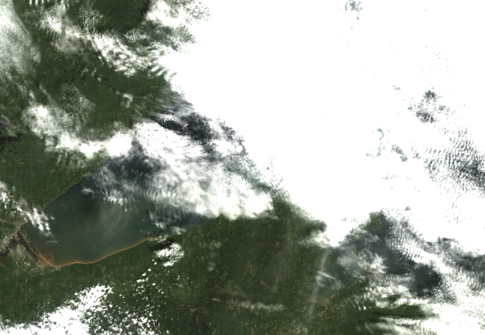
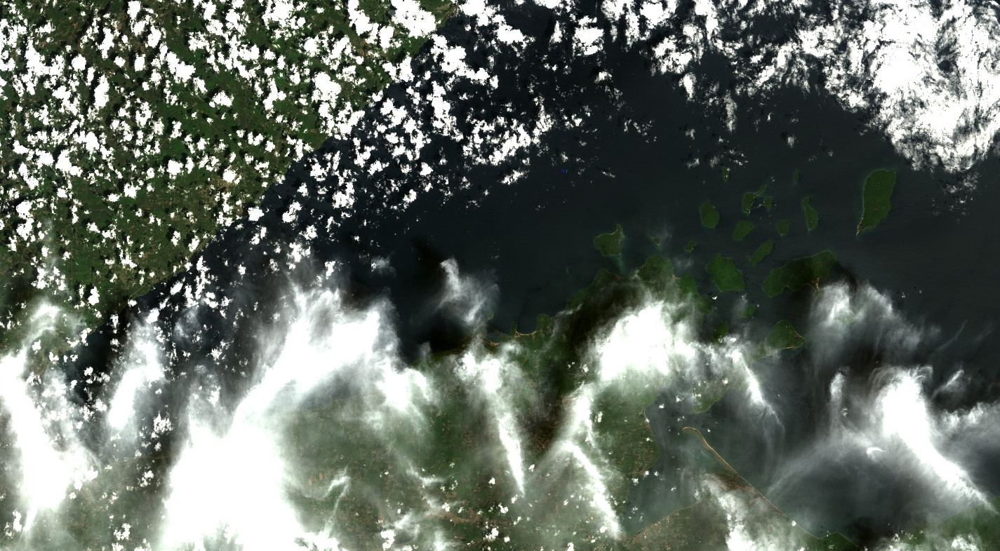
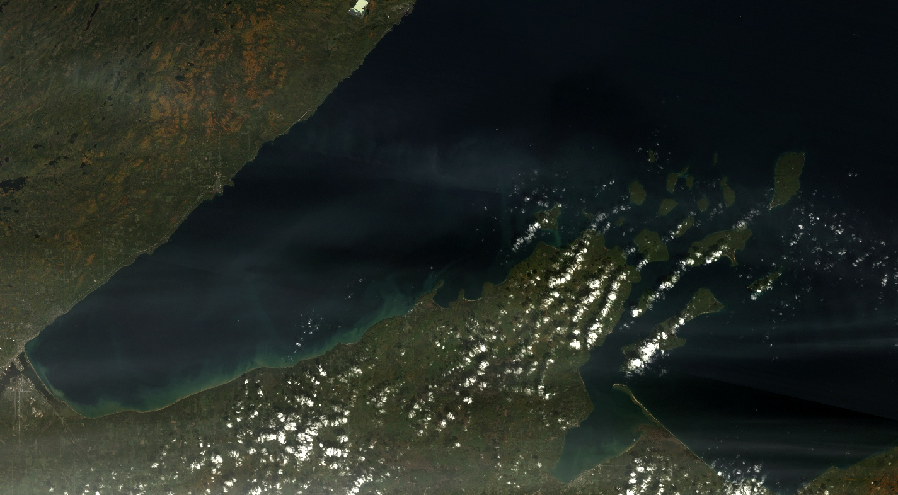

```{r setup, echo = F, message = FALSE}
# keep things quiet
knitr::opts_chunk$set(message = FALSE, error = FALSE, warning = FALSE, fig.dim = c(4,4))

# get all the functions from the src folder and load them
source_files <- list.files("src", full.names = T)
invisible(lapply(source_files, source))
# and the funcs for this analysis
analysis_funcs <- list.files("modeling/src", full.names = T)
invisible(lapply(analysis_funcs, source))
# list/load/download the packages needed for this script
packages <- c('rstatix',
              'tidyverse',
              'ggthemes',
              'GGally',
              'knitr')
invisible(lapply(packages, package_loader))
```

# Purpose

This script takes a deep dive into Landsat 5 labels for a more rigorous analysis
of inconsistent band data and outliers in the filtered label dataset. Here we
will determine if any more label data points should be removed from the training
dataset and whether or not we can glean anything from the metadata in the
outlier dataset to be able to pre-emptively toss out scenes when we go to apply
the classification algorithm.

```{r}
harmonize_version = "2024-04-25"
outlier_version = "2024-04-25"

LS5 <- read_rds(paste0("data/labels/harmonized_LS57_labels_", harmonize_version, ".RDS")) %>% 
  filter(mission == "LANDSAT_5")
```

## Check for mis-matched band data between user data and re-pull

Just look at the data to see consistent (or inconsistent) user-pulled data and
our pull, here, our user data are in "BX" format and the re-pull is in "SR_BX"
format. These are steps to assure data quality if the volunteer didn't follow
the directions explicitly, or if there are differences in the re-pull. The re-pull 
masks out saturated pixels, so any instance where the "SR_BX" value is NA indicates
that the pixel was saturated in at least one band.

```{r, echo=FALSE}
pmap(.l = list(user_band = LS57_user,
               ee_band = LS57_ee,
               data = list(LS5),
               mission = list("LANDSAT_5")),
     .f = make_band_comp_plot)
```

There is some mis-match here, let's filter any labels where at least one band value
doesn't match between the user pull and the re-pull.

```{r}
LS5_inconsistent <- LS5 %>% 
  filter(is.na(SR_B7) | B1 != SR_B1 | B2 != SR_B2 | B3 != SR_B3 | 
           B4 != SR_B4 | B5 != SR_B5 | B7 != SR_B7)

LS5_inconsistent %>% 
  group_by(class) %>% 
  summarise(n_labels = n()) %>% 
  kable()
```

Most of these are cloud labels, where the pixel is saturated, and then masked in
the re-pull value (resulting in an NA). Let's drop those from this subset and
then look more.

```{r}
LS5_inconsistent <- LS5_inconsistent %>% 
  filter(!is.na(SR_B7)) 
```

This leaves `r round(nrow(LS5_inconsistent)/nrow(LS5)*100, 1)`% of the Landsat
7 labels as inconsistent. Let's do a quick sanity check to make sure that we've
dropped values that are inconsistent between pulls and where any band value is
greater than 1:

```{r}
LS5_filtered <- LS5 %>% 
  filter(# filter data where the repull data and user data match
         (B1 == SR_B1 & B2 == SR_B2 & B3 == SR_B3 & 
           B4 == SR_B4 & B5 == SR_B5 & B7 == SR_B7),
         # or where any re-pulled band value is greater than 1, which isn't a valid value
         if_all(LS57_ee,
                ~ . <= 1))
```

And plot:

```{r, echo=FALSE}
pmap(.l = list(user_band = LS57_user,
               ee_band = LS57_ee,
               data = list(LS5_filtered),
               mission = list("LANDSAT_5")),
     .f = make_band_comp_plot)
```

And now let's look at the data by class:

```{r, echo=FALSE}
pmap(.l = list(data = list(LS5_filtered),
               data_name = list("LANDSAT_5"),
               band = LS57_ee),
     .f = make_class_comp_plot)
```

We aren't actually modeling "other" (not sufficient observations to classify) or
"shorelineContamination" (we'll use this later to block areas where there is
likely shoreline contamination in the AOI), so let's drop those categories and
look at the data again. We'll also drop the B1-B7 columns here.

```{r}
LS5_for_class_analysis <- LS5_filtered %>% 
  filter(!(class %in% c("other", "shorelineContamination"))) %>% 
  select(-c(B1:B7))
```

```{r, echo=FALSE}
pmap(.l = list(data = list(LS5_for_class_analysis),
               data_name = list("LANDSAT_5"),
               band = LS57_ee),
     .f = make_class_comp_plot)
```

### Check for systemic volunteer inconsistencies

Let's also go back and check to see if there is any pattern to the inconsistent
labels.

```{r, echo = FALSE}
LS5_inconsistent %>% 
  filter(!is.na(SR_B1)) %>% 
  group_by(vol_init) %>% 
  summarise(n_tot_labs = n(),
            n_dates = length(unique(date))) %>% 
  arrange(-n_dates) %>% 
  kable()
```

There seem to be just a few inconsistencies here and across multiple dates. This
could just be a processing difference (if there happened to be an update to a
scene since users pulled these data or if these were on an overlapping portion
of two scenes). I'm not concerned about any systemic errors here that might
require modified data handling for a specific scene or contributor.

## Outlier handling

There are statistical outliers within this dataset and they may impact the
interpretation of any statistical testing we do. Let's see if we can narrow down
when those outliers and/or glean anything from the outlier data that may be
applicable to the the application of the algorithm. Outliers may be a systemic
issue (as in the scene is an outlier), it could be a user issue (a user may have
been a bad actor), or they just might be real. This section asks those
questions. The "true outliers" that we dismiss from the dataset will also be
used to help aid in interpretation/application of the algorithm across the
Landsat stack, so it is important to make notes of any patterns we might see in
the outlier dataset.

```{r, echo=FALSE}
vertical_data <- LS5_for_class_analysis %>% 
  pivot_longer(LS57_ee,
             names_to = "band_name",
             values_to = "value") %>% 
  rowid_to_column()
vert_out <- vertical_data %>% 
  select(user_label_id, rowid, date, class, band_name, value, vol_init) %>% 
  group_by(class, band_name) %>% 
  identify_outliers(., value) %>% 
  filter(is.extreme)
outliers <- vert_out  %>% 
  left_join(vertical_data) %>%
  select(-rowid)%>% 
  pivot_wider(names_from = band_name,
              values_from = value,
              values_fn = max)

print("Classes represented in outliers:")
unique(outliers$class)
```

Okay, `r nrow(outliers)` of extreme outliers (\>1.5\*IQR) out of
`r nrow(LS5_for_class_analysis)` total labels across non-cloud classes.

### Systemic contributor/scene errors

Are there any contributors that show up more than others in the outliers
dataset?

```{r, echo = FALSE}
LS5_vol <- LS5_for_class_analysis %>% 
  group_by(vol_init) %>% 
  summarise(n_tot = n()) %>% 
  arrange(-n_tot)
LS5_out_vol <- outliers %>% 
  group_by(vol_init) %>% 
  summarise(n_out = n()) %>% 
  arrange(-n_out)
full_join(LS5_vol, LS5_out_vol) %>% 
  mutate(percent_outlier = round(n_out/n_tot*100,1)) %>% 
  arrange(-percent_outlier) %>% 
  kable()
```

These aren't terrible. All below 10%, nothing egregious.

How many of these outliers are in specific scenes? For the purposes of comparison,
we'll drop the cloud groups.

```{r, echo=FALSE}
LS5_out_date <- outliers %>% 
  group_by(date, vol_init) %>% 
  summarize(n_out = n())
LS5_date <- LS5_for_class_analysis %>% 
  filter(class != "cloud") %>% 
  group_by(date, vol_init) %>% 
  summarise(n_tot = n())
LS5_out_date <- left_join(LS5_out_date, LS5_date) %>% 
  mutate(percent_outlier = round(n_out/n_tot*100,1)) %>% 
  arrange(-percent_outlier)

kable(LS5_out_date)
```

There are two scenes here that have a higher proportion of outliers (\> 20% of total
labels) - perhaps there is something about the AC in these particular scenes? or
the general scene quality? Let's look at the scene-level metadata:

```{r, echo=FALSE}
LS5_out_date %>% 
  filter(percent_outlier > 20) %>% 
  select(date, vol_init) %>% 
  left_join(., LS5) %>% 
  select(date, vol_init, DATA_SOURCE_AIR_TEMPERATURE:max_cloud_cover) %>% 
  distinct() %>% 
  kable()
```

This isn't terribly helpful, we still need to dig a little more.

How many bands are outliers when the data are aggregated back to label? If there
is a large portion of outliers amongst the RGB bands (how users labeled data),
there is probably a systemic problem. If the outliers are in singular bands,
especially those that are not in the visible spectrum, we can dismiss the
individual observations, and probably assert that the scene as a whole is okay
to use in training. First pass, if there are 3 or more bands deemed outliers for
a particular label, let's look at the bands that are outliers:

```{r, echo = FALSE}
vert_out %>%
  group_by(date, class, vol_init, user_label_id) %>% 
  summarise(n_bands_out = n(),
            bands_out = paste(band_name, collapse = "; ")) %>% 
  filter(n_bands_out >= 3) %>% 
  arrange(-n_bands_out) %>% 
  kable()
```

Let's group by image date and volunteer and tally up the number of labels where
at least 3 bands where outliers:

```{r, echo = FALSE}
vert_out %>%
  group_by(date, class, vol_init, user_label_id) %>% 
  summarise(n_bands_out = n(),
            bands_out = paste(band_name, collapse = "; ")) %>% 
  filter(n_bands_out >= 3) %>% 
  ungroup(class, user_label_id) %>% 
  summarise(n_labels = n()) %>% 
  arrange(-n_labels) %>% 
  kable()
```

At the very least, there are issues in the 1988-11-23 scene... but is that user
error? Atmospheric correction?



This looks super hazy, so that may be the issue with this particular scene.
Unfortunately, there is no way to know this from the scene metadata. Let's see
if the SR_ATMOS_OPACITY value is helpful at all:

```{r}
outliers %>% 
  filter(date == "1988-11-23") %>% 
  pluck("SR_ATMOS_OPACITY") %>% 
  range(., na.rm = T)
```

These values are pretty low (this is supposed to indicate hazy conditions), 
let's look at cirrus confidcence across these labels, too:

```{r}
outliers %>% 
    filter(date == "1988-11-23") %>% 
  pluck("cirrus_conf") %>% 
  range(., na.rm = T)
```

Nothing here. How about cloud_conf?

```{r}
outliers %>% 
    filter(date == "1988-11-23") %>% 
  pluck("cloud_conf") %>% 
  range(., na.rm = T)
```

This is low confidence (bit value of 1). How about dialated clouds?

```{r}
outliers %>% 
    filter(date == "1988-11-23") %>% 
  pluck("dialated_cloud") %>% 
  range(., na.rm = T)
```

Nope.

While there doesn't seem to be a systematic way of detecting the haze issue in
this scene (or with the labeled pixels), it is clear that there is an issue with 
this scene. It's also possible that the surrounding bright snow causes issues with
the Rrs calculation. 

### QA Pixels

Do any of the labels have QA pixel indications of contamination? Let's see if 
the medium certainty classification in the QA band is useful here:

```{r}
LS5_for_class_analysis %>% 
  mutate(QA = case_when(cirrus_conf >=2 ~ "cirrus",
                   snowice_conf >= 2 ~ "snow/ice",
                   cloudshad_conf >= 2 ~ "cloud shadow",
                   cloud_conf >= 2 ~ "cloud",
                   TRUE ~ "clear")) %>% 
  group_by(QA) %>% 
  filter(class != "cloud") %>% 
  summarize(n_tot = n()) %>% 
  kable()
```

And how about high certainty:

```{r}
LS5_for_class_analysis %>% 
  mutate(QA = case_when(cirrus_conf >= 3 ~ "cirrus",
                   snowice_conf >= 3 ~ "snow/ice",
                   cloudshad_conf >= 3 ~ "cloud shadow",
                   cloud_conf >= 3 ~ "cloud",
                   TRUE ~ "clear")) %>% 
  group_by(QA) %>% 
  filter(class != "cloud") %>% 
  summarize(n_tot = n()) %>% 
  kable()
```

What about low confidence?

```{r}
LS5_for_class_analysis %>% 
  mutate(QA = case_when(snowice_conf >= 1 ~ "snow/ice",
                   cloudshad_conf >= 1 ~ "cloud shadow",
                   cirrus_conf >= 1 ~ "cirrus",
                   cloud_conf >= 1 ~ "cloud",
                   TRUE ~ "clear")) %>% 
  group_by(QA) %>% 
  filter(class != "cloud") %>% 
  summarize(n_tot = n()) %>% 
  kable()
```

Low confidence is NOT helpful! Let's move forward with medium confidence and look at the
flagged data from all classes except cloud:

```{r}
LS5_qa_flagged <- LS5_for_class_analysis %>% 
  filter((cirrus_conf >= 2 |
           snowice_conf >= 2 |
           cloudshad_conf >= 2 |
           cloud_conf >= 2),
    class != "cloud") %>%
  group_by(date, vol_init) %>% 
  summarise(n_qa_flagged = n()) %>% 
  arrange(-n_qa_flagged)
LS5_tot <- LS5_for_class_analysis %>% 
  group_by(date, vol_init) %>% 
  filter(class != "cloud") %>% 
  summarise(n_tot_labels = n())
left_join(LS5_qa_flagged, LS5_tot) %>% 
  mutate(percent_qa_flagged = round(n_qa_flagged/n_tot_labels*100, 1)) %>% 
  arrange(-percent_qa_flagged) %>% 
  kable()
```

We don't want to be using data that has QA flags for any pixel that isn't labeled
cloud. Let's look at the four images with >20% QA flag labels:

**1987-11-05**

```{r}
LS5_for_class_analysis %>% 
  filter(date == "1987-11-05", class != "cloud",
         (cirrus_conf >= 2 |
           snowice_conf >= 2 |
           cloudshad_conf >= 2 |
           cloud_conf >= 2)) %>% 
  select(class, SR_ATMOS_OPACITY, cirrus_conf, cloud_conf, cloudshad_conf, snowice_conf) %>% 
  kable()
```

These are entirely cloud shadow flags, which makes sense given the extent and 
pattern of clouds. This scene does not seem contaminated with haze (which is 
confimred) by SR_ATMOS_OPACITY values < 0.1.

**1993-06-30**



```{r}
LS5_for_class_analysis %>% 
  filter(date == "1993-06-30", class != "cloud",
         (cirrus_conf >= 2 |
           snowice_conf >= 2 |
           cloudshad_conf >= 2 |
           cloud_conf >= 2)) %>% 
  select(class, SR_ATMOS_OPACITY, cirrus_conf, cloud_conf, cloudshad_conf, snowice_conf) %>% 
  kable()
```

Most of these are high opacity values, indicating some cirrus-type contamination.
Additionally, there is some mis classification of snow and ice here. As indicated
by the opacity values and the qa flags, these pixels should be dropped. SR_ATOMS_OPACITY greater
than 0.3 indicate haze or other cloud presence.

```{r}
LS5_for_class_analysis %>% 
  filter(date == "1993-06-30", class != "cloud") %>% 
  pluck("SR_ATMOS_OPACITY") %>% 
  range()
```


**1990-06-06**


```{r}
LS5_for_class_analysis %>% 
  filter(date == "1990-06-06", class != "cloud",
         (cirrus_conf >= 2 |
           snowice_conf >= 2 |
           cloudshad_conf >= 2 |
           cloud_conf >= 2)) %>% 
  select(class, SR_ATMOS_OPACITY, cirrus_conf, cloud_conf, cloudshad_conf, snowice_conf) %>% 
  kable()
```

Mostly cloud and cloud shadow here. Atmospheric opacity is a bit lower, but still
some that will need to be removed from the training dataset.

**1998-10-02**


```{r}
LS5_for_class_analysis %>% 
  filter(date == "1998-10-02", class != "cloud",
         (cirrus_conf >= 2 |
           snowice_conf >= 2 |
           cloudshad_conf >= 2 |
           cloud_conf >= 2)) %>% 
  select(class, SR_ATMOS_OPACITY, cirrus_conf, cloud_conf, cloudshad_conf, snowice_conf) %>% 
  kable()
```

It's clear there is a bit of haze in this image, that is confirmed by opacity values,
though the opacity is till below the 0.3 cutoff. Using the QA bits here to remove 
medium and high confidence QA flags should resolve any contamination. Let's
also look at the range of atmoshperic opacity across all labels in this scene:

```{r}
LS5_for_class_analysis %>% 
  filter(date == "1998-10-02", class != "cloud") %>% 
  pluck("SR_ATMOS_OPACITY") %>% 
  range()
```

All below the 0.3 threshold. 

And now for the outliers:

```{r}
outliers %>% 
  mutate(QA = case_when(snowice_conf >= 2 ~ "snow/ice",
                   cloudshad_conf >= 2 ~ "cloud shadow",
                   cirrus_conf >= 2 ~ "cirrus",
                   cloud_conf >= 2 ~ "cloud",
                   TRUE ~ "clear")) %>% 
  group_by(QA) %>% 
  filter(class != "cloud") %>% 
  summarize(n_out_tot = n()) %>% 
  kable()
```

And let's look at atmospheric opacity:

```{r}
outliers %>% 
  filter(class != "cloud") %>% 
  pluck("SR_ATMOS_OPACITY") %>% 
  range(na.rm = T)
```

### Clouds

How many of these outliers have near-pixel clouds (as measured by ST_CDIST)?

```{r, echo = FALSE}
LS5_out_CDIST <- outliers %>% 
  filter(ST_CDIST < 0.5) 
# compared with the whole dataset 
LS5_CDIST <- LS5_for_class_analysis %>% 
  filter(class != "cloud" & ST_CDIST < 0.5)
```

There are `r nrow(LS5_out_CDIST)` labels
(`r round(nrow(LS5_out_CDIST)/nrow(outliers)*100, 1)`% of oultiers) that aren't
"cloud" in the outlier dataset that have a cloud distance \<500m and
`r nrow(LS5_CDIST)` labels
(`r round(nrow(LS5_CDIST)/nrow(LS5_for_class_analysis)*100, 1)`%) in the whole
dataset that have a cloud distance \<500m. Since this is about the same portion
of labels (or they are not severely disproportionate), I don't think this is
terribly helpful.

How many of the outliers have high cloud cover, as reported by the scene-level
metadata? Note, we don't have the direct scene cloud cover associated with
individual labels, rather a list of the scene level cloud cover values
associated with the AOI.

```{r, echo = FALSE}
# max
LS5_out_max_cloud <- outliers %>% 
  filter(max_cloud_cover > 75)
# compared with the whole dataset 
LS5_max_cloud <- LS5_for_class_analysis %>% 
  filter(class != "cloud" & max_cloud_cover > 75) 

# mean
LS5_out_mean_cloud <- outliers %>% 
  filter(mean_cloud_cover > 60) 
# compared with the whole dataset 
LS5_mean_cloud <- LS5_for_class_analysis %>% 
  filter(class != "cloud" & mean_cloud_cover > 60) 
```

The outlier dataset contains `r nrow(LS5_out_max_cloud)`
(`r round(nrow(LS5_out_max_cloud)/nrow(outliers)*100, 1)`%) where the max cloud
cover was \> 75% and `r nrow(LS5_out_mean_cloud)`
(`r round(nrow(LS5_out_mean_cloud)/nrow(outliers)*100, 1)`%) where the mean
cloud cover was \> 50%. The filtered dataset contains `r nrow(LS5_max_cloud)`
(`r round(nrow(LS5_max_cloud)/nrow(LS5_for_class_analysis)*100, 1)`%) where max
was \>75% and `r nrow(LS5_mean_cloud)`
(`r round(nrow(LS5_mean_cloud)/nrow(LS5_for_class_analysis)*100, 1)`%) where the
mean cloud cover was \> 50%. Neither of these metrics seem helpful in elimination
of labels from outlier scenes.

### Training dataset implications

Based on the above review, any label with SR_ATMOS_OPACITY value >= 0.3, or a QA
flag for clouds, cloud shadow, or snow ice should be eliminated from this dataset.

```{r}
LS5_training_labels <- LS5_for_class_analysis %>% 
  filter(class == "cloud" |
           (SR_ATMOS_OPACITY < 0.3 &
            cloud_conf < 2 &
            cloudshad_conf <2 & 
            snowice_conf <2))
```

## Testing for inter-class differences

We do want to have an idea of how different the classes are, in regards to band
data. While there are a bunch of interactions that we could get into here, for
the sake of this analysis, we are going to analyze the class differences by
band.

Kruskal-Wallis assumptions:

1)  Data are non-Normal or have a skewed distribution
2)  There must be at least two independent groups.
3)  Data have a similar distribution across groups.
4)  Data are independent, the groups shouldn't have a relationship to one
    another
5)  Each group should contain at least 5 observations

ANOVA assumptions:

1)  data are distributed normally
2)  data have equal variances, if not equal variance perform Kruskal-Wallis
3)  data are independent
4)  variance across groups is similar

We can't entirely assert sample independence and we know that variance and
distribution is different for "cloud" labels, but those data also are visibly
different from the other classes.

In order to systematically test for differences between classes and be able to
interpret the data, we will need to know some things about our data:

1)  Are the data normally distributed (Shapiro-Wilkes)?
2)  Are there outliers that may impact interpretation?
3)  If data is non-normal, perform Kruskal-Wallis test; otherwise ANOVA if equal
variances, otherwise, back to Kruskal-Wallis
4)  if the null is rejected (and there is a difference in at least one class),
    perform post-hoc test for pairwise comparison (Dunn test for both)

With this workflow, most classes are statistically different - below are the
cases where the pairwise comparison were not deemed statistically significant:

```{r, echo = FALSE}
LS57_band_sym = syms(LS57_ee)

LS5_class_analysis <- pmap(.l = list(dataset = list(LS5_training_labels),
                                     bnd = LS57_band_sym,
                                     class_col = list(sym("class"))),
                           .f = test_class_sig)
names(LS5_class_analysis) <- LS57_ee

map(LS5_class_analysis,
    function(band) {
      band$pairwise_difference %>% 
        filter(p.adj.signif == "ns")
    }
  ) %>% 
  list_rbind() %>% 
  rename(band = .y.)
```

There is some consistency here: "darkNearShoreSediment" is often not different
from other sediment types by band. It is entirely possible that band
interactions overpower these non-significant differences.

Let's look at the boxplots for the training labels, dropping the cloud labels to
see the ranges better:

```{r}
LS5_training_labels_no_clouds <- LS5_training_labels %>% 
  filter(class != "cloud")
pmap(.l = list(data = list(LS5_training_labels_no_clouds),
               data_name = list("LANDSAT_5"),
               band = LS57_ee),
     .f = make_class_comp_plot)
```

There are `r nrow(LS5_class_analysis$SR_B1$outliers)` outliers in SR_B1, `r nrow(LS5_class_analysis$SR_B2$outliers)` in SR_B2, `r nrow(LS5_class_analysis$SR_B3$outliers)` in SR_B3, `r nrow(LS5_class_analysis$SR_B4$outliers)` in SR_B4, `r nrow(LS5_class_analysis$SR_B5$outliers)` in SR_B5, and `r nrow(LS5_class_analysis$SR_B7$outliers)` in SR_B7.

```{r, echo=FALSE, fig.dim=c(10,10), fig.cap="DNSS: dark near shore sediment, LNSS: light near shore sediment, OSS: offshore sediment"}
LS5_training_labels %>% 
  mutate(class_short = case_when(class == "darkNearShoreSediment" ~ "DNSS",
                                 class == "lightNearShoreSediment" ~ "LNSS",
                                 class == "offShoreSediment" ~ "OSS",
                                 TRUE ~ class)) %>% 
ggpairs(., columns = LS57_ee, aes(color = class_short)) + 
  scale_color_colorblind() +
  scale_fill_colorblind() +
  theme_few()
```

There are definitely some varying patterns here, let's zoom in on the sediment
classes.

```{r, echo=FALSE, fig.dim=c(8,8), fig.cap="DNSS: dark near shore sediment, LNSS: light near shore sediment, OSS: offshore sediment"}
LS5_training_labels %>% 
  mutate(class_short = case_when(class == "darkNearShoreSediment" ~ "DNSS",
                                 class == "lightNearShoreSediment" ~ "LNSS",
                                 class == "offShoreSediment" ~ "OSS",
                                 TRUE ~ class)) %>% 
  filter(grepl("Sediment", class)) %>% 
ggpairs(., columns = LS57_ee, aes(color = class_short)) + 
  scale_color_colorblind() +
  scale_fill_colorblind() +
  theme_few()
```

Okay, this seems sensical as to why there is no significant difference in many
of the band-level "darkNearShoreSediment" labels - there's a lot of overlap in
ranges. Looking at these scatter plot matrices, I do think there are likely
different enough patterns when considering multiple bands that ML should be able
to pick up on subtle differences.

### Aggregating sediment classes and performing statistical tests

As a back up, we should consider using aggregated sediment classes, where any 
label of sediment is treated as a general class of "sediment". Let's do the same 
process here to test for class significance.

```{r, echo = FALSE}
LS5_training_labels <- LS5_training_labels %>% 
  mutate(agg_class = if_else(grepl("Sediment", class),
                             "sediment",
                             class))

LS5_class_analysis_aggregated <- pmap(.l = list(dataset = list(LS5_training_labels),
                                     bnd = LS57_band_sym,
                                     class_col = list(sym("agg_class"))),
                           .f = test_class_sig)
names(LS5_class_analysis_aggregated) <- LS57_ee

map(LS5_class_analysis_aggregated,
    function(band) {
      band$pairwise_difference %>% 
        filter(p.adj.signif == "ns")
    }
  ) %>% 
  list_rbind() %>% 
  rename(band = .y.)
```

And let's look at the scatter plots here:

```{r, echo=FALSE, fig.dim=c(10,10)}
LS5_training_labels %>% 
ggpairs(., columns = LS57_ee, aes(color = agg_class)) + 
  scale_color_colorblind() +
  scale_fill_colorblind() +
  theme_few()
```

And if we drop the cloud:

```{r}
LS5_training_labels %>% 
  filter(agg_class != "cloud") %>% 
ggpairs(., columns = LS57_ee, aes(color = agg_class)) + 
  scale_color_colorblind() +
  scale_fill_colorblind() +
  theme_few()
```


## Export the training labels

Things to note for Landsat 5:

-   pixels with QA flags should be dismissed from model application

-   pixels with SR_ATMOS_OPACITY > 0.3 should be dismissed from model application

```{r}
write_rds(LS5_training_labels, paste0("data/labels/LS5_labels_for_tvt_", outlier_version, ".RDS"))
```
