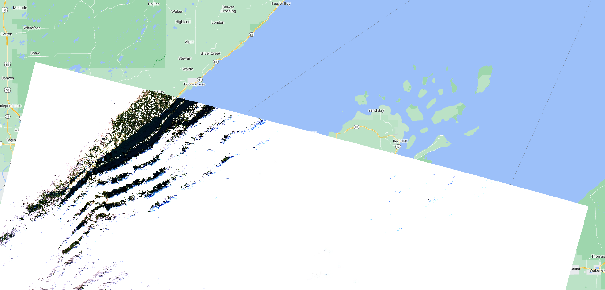
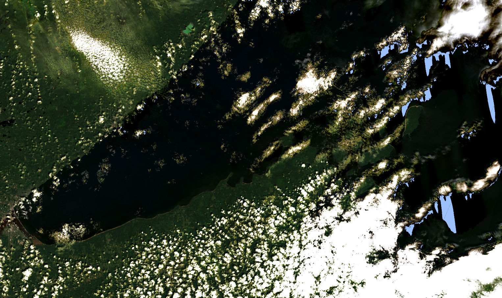
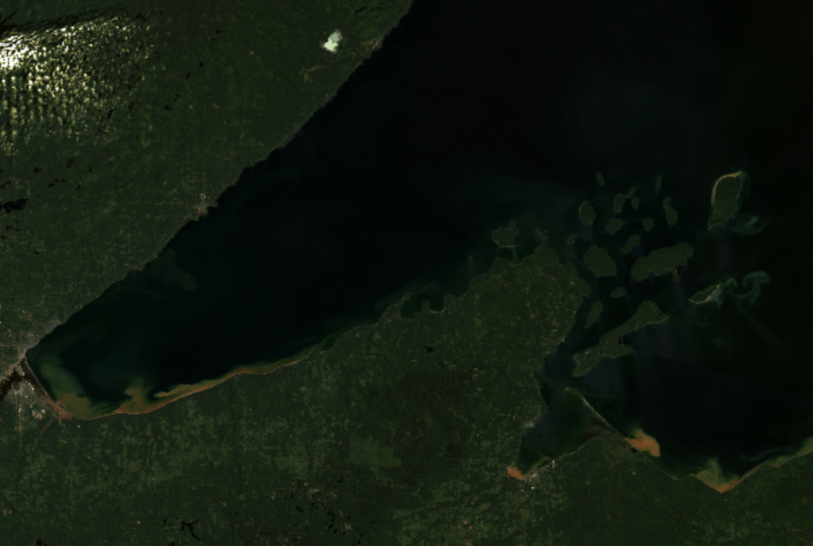
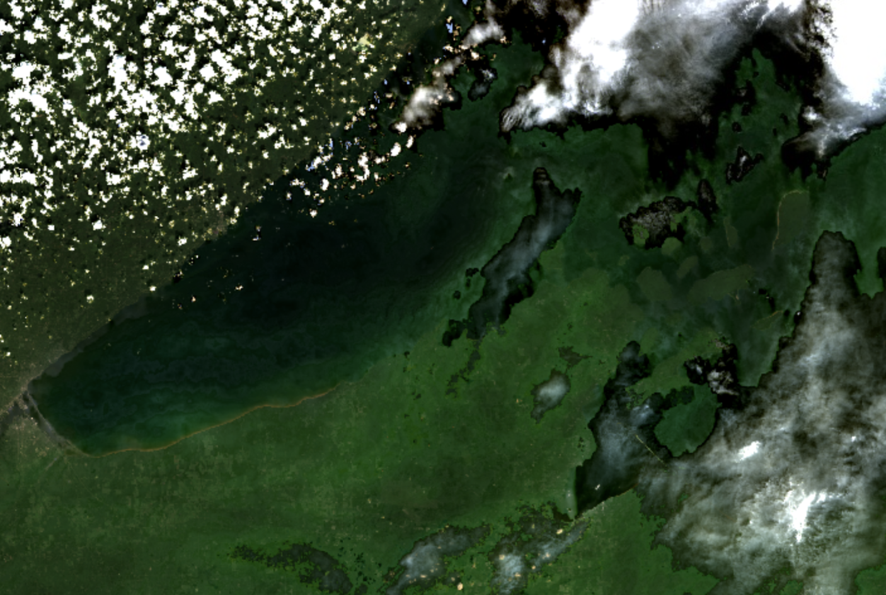
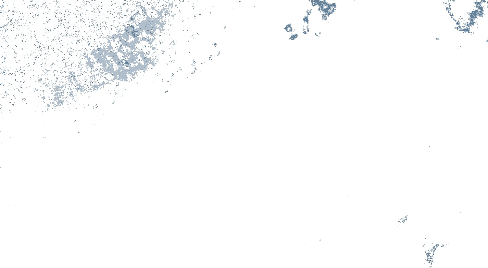

```{r setup, echo = F, message = FALSE}
# keep things quiet
knitr::opts_chunk$set(message = FALSE, error = FALSE, warning = FALSE, fig.dim = c(4,4))

# get all the functions from the src folder and load them
source_files <- list.files("src", full.names = T)
invisible(lapply(source_files, source))
# and the funcs for this analysis
analysis_funcs <- list.files("modeling/src", full.names = T)
invisible(lapply(analysis_funcs, source))
# list/load/download the packages needed for this script
packages <- c('rstatix',
              'tidyverse',
              'ggthemes',
              'GGally',
              'knitr')
invisible(lapply(packages, package_loader))
```

# Purpose

This script takes a deep dive into Landsat 8 labels for a more rigorous analysis
of inconsistent band data and outliers in the filtered label dataset. Here we
will determine if any more label data points should be removed from the training
dataset and whether or not we can glean anything from the metadata in the
outlier dataset to be able to pre-emptively toss out scenes when we go to apply
the classification algorithm.

```{r}
harmonize_version = "2024-04-25"
outlier_version = "2024-04-25"

LS8 <- read_rds(paste0("data/labels/harmonized_LS89_labels_", harmonize_version, ".RDS")) %>% 
  filter(mission == "LANDSAT_8")
```

## Check for mis-matched band data between user data and re-pull

Just look at the data to see consistent (or inconsistent) user-pulled data and
our pull, here, our user data are in "BX" format and the re-pull is in "SR_BX"
format. These are steps to assure data quality if the volunteer didn't follow
the directions explicitly.

```{r}
pmap(.l = list(user_band = LS89_user,
               ee_band = LS89_ee,
               data = list(LS8),
               mission = list("LANDSAT_8")),
     .f = make_band_comp_plot)
```

There isn't a ton of mis-match here, we'll just use B7/SR_B7 as a reference to
filter inconsistent labels

```{r}
LS8_inconsistent <- LS8 %>% 
  filter(is.na(SR_B7) | B2 != SR_B2 | B3 != SR_B3 | 
           B4 != SR_B4 | B5 != SR_B5 | B6 != SR_B6 | B7 != SR_B7)

LS8_inconsistent %>% 
  group_by(class) %>% 
  summarise(n_labels = n()) %>% 
  kable()
```

None of these are inconsistent because of saturated pixels:

```{r}
LS8 %>% 
  filter(is.na(SR_B7)) %>% 
  nrow()
```

This leaves `r round(nrow(LS8_inconsistent)/nrow(LS8)*100, 1)`% of the Landsat 7
labels as inconsistent - we'll dig more into this in a bit. Let's do a quick 
sanity check to make sure that we've
dropped values that are inconsistent between pulls:

```{r}
LS8_filtered <- LS8 %>% 
  filter(# filter data where the repull data and user data match
         (B2 == SR_B2 & B3 == SR_B3 & 
           B4 == SR_B4 & B5 == SR_B5 & B6 == SR_B6 & B7 == SR_B7),
         # or where any re-pulled band value is greater than 1, which isn't a valid value
         if_all(LS89_ee,
                ~ . <= 1))
```

And plot:

```{r, echo=FALSE}
pmap(.l = list(user_band = LS89_user,
               ee_band = LS89_ee,
               data = list(LS8_filtered),
               mission = list("LANDSAT_8")),
     .f = make_band_comp_plot)
```

And now let's look at the data by class:

```{r, echo=FALSE}
pmap(.l = list(data = list(LS8_filtered),
               data_name = list("LANDSAT_8"),
               band = LS89_ee),
     .f = make_class_comp_plot)
```

We aren't actually modeling "other" (not sufficient observations to classify) or
"shorelineContamination" (we'll use this later to block areas where there is
likely shoreline contamination in the AOI). Additionally, the "algalBloom"
labels don't have sufficient n (nor do we think these are necessarily visible),
so let's drop those categories and look at the data again. Since we've completed
the process of comparison between the user pull and the re-pull, let's remove the
user-pulled band data, too.

```{r}
LS8_for_class_analysis <- LS8_filtered %>% 
  filter(!(class %in% c("other", "shorelineContamination", "algalBloom"))) %>% 
  select(-c(B2:B7))
```

```{r, echo=FALSE}
pmap(.l = list(data = list(LS8_for_class_analysis),
               data_name = list("LANDSAT_8"),
               band = LS89_ee),
     .f = make_class_comp_plot)
```

Interesting - the classes look really similar in distribution (maybe because
cloud categories are so high). It will be interesting to see if there are
statistical differences.

### Check for systemic volunteer inconsistencies

Let's also go back and check to see if there is any pattern to the inconsistent
labels.

```{r, echo = FALSE}
LS8_inconsistent %>% 
  group_by(vol_init) %>% 
  summarise(n_tot_labs = n(),
            n_dates = length(unique(date))) %>% 
  arrange(-n_dates) %>% 
  kable()
```

Let's look at these by image date:

```{r}
L8_tot <- LS8 %>% 
  group_by(vol_init, date) %>% 
  summarise(n_tot_labels = n())
LS8_inconsistent %>% 
  group_by(vol_init, date) %>% 
  summarise(n_incon_labs = n()) %>% 
  arrange(-n_incon_labs) %>%
  left_join(L8_tot) %>% 
  mutate(perc_incon_labels = round((n_incon_labs/n_tot_labels)*100, 1)) %>% 
  arrange(-perc_incon_labels) %>% 
  kable()
```

Let's look to see if the scenes for 2022-08-01 have been reprocessed since the
user export date. 

```{r}
read_csv("data/labels/collated_scene_metadata_LS8_LS9_v2024-04-25.csv") %>% 
  filter(DATE_ACQUIRED == "2022-08-01") %>% 
  pluck("LANDSAT_PRODUCT_ID")
```

Nope (the second 8-digit number is the date it was processed to L2). It's possible that there was a scene-level issue that we'll find later, or
that the user didn't follow directions, either way, this scene will be dropped at
the end, but we'll keep it for the time being and see if it's problematic anywhere
else.

## Outlier handling

There are statistical outliers within this dataset and they may impact the
interpretation of any statistical testing we do. Let's see if we can narrow down
when those outliers and/or glean anything from the outlier data that may be
applicable to the the application of the algorithm. Outliers may be a systemic
issue (as in the scene is an outlier), it could be a user issue (a user may have
been a bad actor), or they just might be real. This section asks those
questions. The "true outliers" that we dismiss from the dataset will also be
used to help aid in interpretation/application of the algorithm across the
Landsat stack, so it is important to make notes of any patterns we might see in
the outlier dataset.

```{r, echo=FALSE}
vertical_data <- LS8_for_class_analysis %>% 
  pivot_longer(LS89_ee,
             names_to = "band_name",
             values_to = "value") %>% 
  rowid_to_column()
vert_out <- vertical_data %>% 
  select(user_label_id, rowid, date, class, band_name, value, vol_init) %>% 
  group_by(class, band_name) %>% 
  identify_outliers(., value) %>% 
  filter(is.extreme)
outliers <- vert_out  %>% 
  left_join(vertical_data) %>%
  select(-rowid)%>% 
  pivot_wider(names_from = band_name,
              values_from = value,
              values_fn = max)

print("Classes represented in outliers:")
unique(outliers$class)
```

Okay, `r nrow(outliers)` outliers (\>1.5\*IQR) out of
`r nrow(LS8_for_class_analysis)` - and they are all from non-cloud groups, and
none of them are light near shore sediment.

### Scene Level Metadata

How many of these outliers are in specific scenes?

```{r}
LS8_out_date <- outliers %>% 
  group_by(date, vol_init) %>% 
  summarize(n_out = n())
LS8_date <- LS8_for_class_analysis %>% 
  filter(class != "cloud") %>% 
  group_by(date, vol_init) %>% 
  summarise(n_tot = n())
LS8_out_date <- left_join(LS8_out_date, LS8_date) %>% 
  mutate(percent_outlier = n_out/n_tot*100) %>% 
  arrange(-percent_outlier)
LS8_out_date %>% 
  kable()
```

There are two scenes here that have very high outliers, one is that August 2022
scene - perhaps there is
something about the AC in these particular scenes? or the general scene quality?

```{r}
LS8_out_date %>% 
  filter(percent_outlier > 20) %>% 
  select(date, vol_init) %>% 
  left_join(., LS8) %>% 
  select(date, vol_init, DATA_SOURCE_AIR_TEMPERATURE:max_cloud_cover) %>% 
  distinct() %>% 
  kable()
```

Image quality is high across the board, and the cloud cover is generally moderate.

Let's look at these two images:



Another case of high cloud cover and adjacent snow! We should definitely toss
this scene (but we'll wait to do that later, after we've looked to see if aerosol
is high in the QA band step, since there is nothing from the metadata that would
indicate this scene would be problematic). For consistency, let's look at 
instances where outliers are in at
least three bands for a given label:

```{r, echo = FALSE}
vert_out %>%
  group_by(date, class, vol_init, user_label_id) %>% 
  summarise(n_bands_out = n(),
            bands_out = paste(band_name, collapse = "; ")) %>% 
  filter(n_bands_out >= 3) %>% 
  arrange(-n_bands_out) %>% 
  kable()
```

Let's group by image date and volunteer and tally up the number of labels where
at least 3 bands where outliers:

```{r, echo = FALSE}
vert_out %>%
  group_by(date, class, vol_init, user_label_id) %>% 
  summarise(n_bands_out = n(),
            bands_out = paste(band_name, collapse = "; ")) %>% 
  filter(n_bands_out >= 3) %>% 
  ungroup(class, user_label_id) %>% 
  summarise(n_labels = n()) %>% 
  arrange(-n_labels) %>% 
  kable()
```

We are already going to toss this scene, but let's look at it:



This scene has the weird green cloud situation happening and the south-extending
NA data on the west side of the AOI. Let's look at image quality here:

```{r}
LS8_for_class_analysis %>% 
  filter(date == "2022-08-01") %>% 
  pluck("IMAGE_QUALITY_OLI_list") %>% 
  unique() %>% 
  unlist()
```

That's not helpful - the image quality is the highest it can be. The QA pixels
might be more helpful here.

### Clouds

How many of these outliers have near-pixel clouds (as measured by ST_CDIST)?

```{r, echo = FALSE}
LS8_out_CDIST <- outliers %>% 
  filter(class != "cloud" & ST_CDIST < 50) 
# compared with the whole dataset 
LS8_CDIST <- LS8_for_class_analysis %>% 
  filter(class != "cloud" & ST_CDIST < 50)
```

There are `r nrow(LS8_out_CDIST)` labels
(`r round(nrow(LS8_out_CDIST)/nrow(outliers)*100, 1)`% of oultiers) that aren't
"cloud" in the outlier dataset that have a cloud distance \<500m and
`r nrow(LS8_CDIST)` labels
(`r round(nrow(LS8_CDIST)/nrow(LS8_for_class_analysis)*100, 1)`%) in the whole
dataset that have a cloud distance \<500m. Since this is about the same portion
of labels (or they are not severely disproportionate), I don't think this is
terribly helpful.

How many of the outliers have high cloud cover, as reported by the scene-level
metadata? Note, we don't have the direct scene cloud cover associated with
individual labels, rather a list of the scene level cloud cover values
associated with the AOI.

```{r, echo = FALSE}
# max
LS8_out_max_cloud <- outliers %>% 
  rowwise() %>% 
  filter(max_cloud_cover > 75) 
# compared with the whole dataset 
LS8_max_cloud <- LS8_for_class_analysis %>% 
  rowwise() %>% 
  filter(class != "cloud" & max_cloud_cover > 75) 

# mean
LS8_out_mean_cloud <- outliers %>% 
  rowwise() %>% 
  filter(mean_cloud_cover > 60) 
# compared with the whole dataset 
LS8_mean_cloud <- LS8_for_class_analysis %>% 
  rowwise() %>% 
  filter(class != "cloud" & mean_cloud_cover > 60) 
```

The outlier dataset contains `r nrow(LS8_out_max_cloud)`
(`r round(nrow(LS8_out_max_cloud)/nrow(outliers)*100, 1)`%) where the max cloud
cover was \> 75% and `r nrow(LS8_out_mean_cloud)`
(`r round(nrow(LS8_out_mean_cloud)/nrow(outliers)*100, 1)`%) where the mean
cloud cover was \> 50%. The filtered dataset contains `r nrow(LS8_max_cloud)`
(`r round(nrow(LS8_max_cloud)/nrow(LS8_for_class_analysis)*100, 1)`%) where max
was \>75% and `r nrow(LS8_mean_cloud)`
(`r round(nrow(LS8_mean_cloud)/nrow(LS8_for_class_analysis)*100, 1)`%) where the
mean cloud cover was \> 50%. Welp, this is unhelpful!

### QA Pixels

Do any of the labels have QA pixel indications of contamination? Let's see if 
the high certainty classification in the QA band is useful here:

```{r}
LS8_for_class_analysis %>% 
  mutate(QA = case_when(cirrus_conf >= 3 ~ "cirrus",
                        cloud_conf >= 3 ~ "cloud",
                        cloudshad_conf >= 3 ~ "cloud shadow",
                        snowice_conf >= 3 ~ "snow/ice",
                        TRUE ~ "clear")) %>% 
  group_by(QA) %>% 
  filter(class != "cloud") %>% 
  summarize(n_tot = n()) %>% 
  kable()
```

Low confidence, like with LS5/7 is too conservative (would flag all labels), 
so we'll stick with high
confidence since there isn't medium confidence in the QA bits for LS8/9.

Let's look at the cloud shadow group to see if there is
anything egregious:

```{r}
LS8_for_class_analysis %>% 
  filter(cloudshad_conf >= 3, class != "cloud") %>% 
  group_by(date, vol_init) %>% 
  summarise(n_cloud_shadow = n()) %>% 
  arrange(-n_cloud_shadow) %>% 
  left_join(L8_tot) %>% 
  mutate(perc_cloud_shad = round((n_cloud_shadow/n_tot_labels)*100, 1)) %>% 
  kable()
```

We already know that the highest ranked cloud shadow scene here (2022-11-21) is also one we
are going to drop, so I don't think there is anything else to pursue here.

### Aerosol QA bit

Landsat 8 and 9 feature an Aerosol QA band, derived from Band 1. We should look
through the data here to see if any of the labels are in high aerosol QA pixels,
which the USGS suggests should not be used.

```{r}
LS8_for_class_analysis %>% 
  filter(aero_level == 3, class != "cloud") %>% 
  group_by(date) %>%
  summarise(n_high_aero_labels = n()) %>% 
  left_join(L8_tot) %>% 
  mutate(perc_high_aero = round(n_high_aero_labels/n_tot_labels*100, 1)) %>% 
  arrange(-perc_high_aero) %>% 
  kable()

```

Let's look at the 2020-08-11 and 2017-09-04 images. First 2020-08-11:



This image is clear as day, but if you zoom in near the Apostle Islands, you can
see the haze. As suggested by the USGS, I think it is fine to just toss labels
where aerosol is high. 

And 2017-09-04:



Woah! I understand now why there might be some algae bloom labels in this
dataset. This is very hazy - I'm also interested in the scene quality here:

```{r}
LS8_for_class_analysis %>% 
  filter(date == "2017-09-04") %>% 
  pluck("IMAGE_QUALITY_OLI_list") %>% 
  unique() %>% 
  unlist()
```

Well that's surprising. I guess this is truly an instance where we're going to
have to trust the LS8 Aerosol bit and mask out all high aerosol pixels and toss
all labels that are flagged with high aerosol. This scene has 23 of 
`r LS8_for_class_analysis %>% filter(date == "2017-09-04") %>% nrow()` labels that
are flagged as high aerosol, but I argue anything in this scene should be tossed. 

If I map out the aerosol flag in GEE, it looks like this, where white is 'high 
aerosol':



Generally speaking, this is an invalid scene.

### Training dataset implications

For the purposes of training data, we are going to throw out scene that had a 
majority of inconsistent band values between the user pull and re-pull (202-08-01), 
and the high aerosol scene 2017-09-04, as well as any label where aerosol is high,
or any of the QA flags have high confidence for clouds, cloud shadows, snow/ice.

```{r}
LS8_training_labels <- LS8_for_class_analysis %>% 
  filter(!(date %in% c("2022-08-01", "2017-09-04"))) %>% 
  filter(class == "cloud" |
           (aero_level < 3 &
              cirrus_conf < 3 &
              cloud_conf < 3 &
              cloudshad_conf < 3 & 
              snowice_conf < 3))
```

## Testing for inter-class differences

We do want to have an idea of how different the classes are, in regards to band
data. While there are a bunch of interactions that we could get into here, for
the sake of this analysis, we are going to analyze the class differences by
band.

Kruskal-Wallis assumptions:

1)  Data are non-Normal or have a skewed distribution
2)  There must be at least two independent groups.
3)  Data have a similar distribution across groups.
4)  Data are independent, the groups shouldn't have a relationship to one
    another
5)  Each group should contain at least 5 observations

ANOVA assumptions:

1)  data are distributed normally
2)  data have equal variances, if not equal variance perform Kruskal-Wallis
3)  data are independent
4)  variance across groups is similar

We can't entirely assert sample independence and we know that variance and
distribution is different for "cloud" labels, but those data also are visibly
different from the other classes.

In order to systematically test for differences between classes and be able to
interpret the data, we will need to know some things about our data:

1)  Are the data normally distributed (Shapiro-Wilkes)?
2)  Are there outliers that may impact interpretation?
3)  If data is non-normal, perform Kruskal-Wallis test; otherwise ANOVA if equal
variances, otherwise, back to Kruskal-Wallis
4)  if the null is rejected (and there is a difference in at least one class),
    perform post-hoc test for pairwise comparison (Dunn test for both)

With this workflow, most classes are statistically different - below are the
cases where the pairwise comparison were not deemed statistically significant:

```{r, echo = FALSE}
LS89_band_sym = syms(LS89_ee)

LS8_class_analysis <- pmap(.l = list(dataset = list(LS8_training_labels),
                                     bnd = LS89_band_sym,
                                     class_col = list(sym("class"))),
                           .f = test_class_sig)
names(LS8_class_analysis) <- LS89_ee

map(LS8_class_analysis,
    function(band) {
      band$pairwise_difference %>% 
        filter(p.adj.signif == "ns")
    }
  ) %>% 
  list_rbind() %>% 
  rename(band = .y.)
```

Alright, all over the map here - dark near shore is still a problem, but also
some issues with offshore sediment, open water, and light near shore sediment.
This could be problematic. We'll have to see how these data look and hope that
ML can pick up on the subtle differences.

Let's look at the boxplots of the non-cloud classes:

```{r}
LS8_training_labels_no_clouds <- LS8_training_labels %>% 
  filter(class != "cloud")
pmap(.l = list(data = list(LS8_training_labels_no_clouds),
               data_name = list("LANDSAT_5"),
               band = LS89_ee),
     .f = make_class_comp_plot)
```

There are `r nrow(LS8_class_analysis$SR_B2$outliers)` in SR_B2, `r nrow(LS8_class_analysis$SR_B3$outliers)` in SR_B3, `r nrow(LS8_class_analysis$SR_B4$outliers)` in SR_B4, `r nrow(LS8_class_analysis$SR_B5$outliers)` in SR_B5, `r nrow(LS8_class_analysis$SR_B6$outliers)` outliers in SR_B6, and `r nrow(LS8_class_analysis$SR_B7$outliers)` in SR_B7.

```{r, echo=FALSE, fig.dim=c(10,10), fig.cap="DNSS: dark near shore sediment, LNSS: light near shore sediment, OSS: offshore sediment"}
LS8_training_labels %>% 
  mutate(class_short = case_when(class == "darkNearShoreSediment" ~ "DNSS",
                                 class == "lightNearShoreSediment" ~ "LNSS",
                                 class == "offShoreSediment" ~ "OSS",
                                 TRUE ~ class)) %>% 
ggpairs(., columns = LS89_ee, aes(color = class_short)) + 
  scale_color_colorblind() +
  scale_fill_colorblind() +
  theme_few()
```

There are definitely some varying patterns here, let's zoom in on the sediment
classes.

```{r, echo=FALSE, fig.dim=c(8,8), fig.cap="DNSS: dark near shore sediment, LNSS: light near shore sediment, OSS: offshore sediment"}
LS8_training_labels %>% 
  mutate(class_short = case_when(class == "darkNearShoreSediment" ~ "DNSS",
                                 class == "lightNearShoreSediment" ~ "LNSS",
                                 class == "offShoreSediment" ~ "OSS",
                                 TRUE ~ class)) %>% 
  filter(grepl("Sediment", class) | class == "openWater") %>% 
ggpairs(., columns = LS89_ee, aes(color = class_short)) + 
  scale_color_colorblind() +
  scale_fill_colorblind() +
  theme_few()
```

Hmm, this is a true scatter shot. It will be interesting to see what happens in
development and application. 

### Aggregating sediment classes and performing statistical tests

As a back up, we should consider using aggregated sediment classes, where any 
label of sediment is treated as a general class of "sediment". Let's do the same 
process here to test for class significance.

```{r, echo = FALSE}
LS8_training_labels <- LS8_training_labels %>% 
  mutate(agg_class = if_else(grepl("Sediment", class),
                             "sediment",
                             class))

LS8_class_analysis_aggregated <- pmap(.l = list(dataset = list(LS8_training_labels),
                                     bnd = LS89_band_sym,
                                     class_col = list(sym("agg_class"))),
                           .f = test_class_sig)
names(LS8_class_analysis_aggregated) <- LS89_ee

map(LS8_class_analysis_aggregated,
    function(band) {
      band$pairwise_difference %>% 
        filter(p.adj.signif == "ns")
    }
  ) %>% 
  list_rbind() %>% 
  rename(band = .y.)
```

And let's look at the scatter plots here:

```{r, echo=FALSE, fig.dim=c(10,10)}
LS8_training_labels %>% 
ggpairs(., columns = LS89_ee, aes(color = agg_class)) + 
  scale_color_colorblind() +
  scale_fill_colorblind() +
  theme_few()
```

And if we drop the cloud:

```{r}
LS8_training_labels %>% 
  filter(agg_class != "cloud") %>% 
ggpairs(., columns = LS89_ee, aes(color = agg_class)) + 
  scale_color_colorblind() +
  scale_fill_colorblind() +
  theme_few()
```

Okay, this may be a reasonable backup, even if it's kind of boring...

## Export the training labels

Things to note for Landsat 8:

-   bright cloud cover and snow may impact Rrs within the waterbody leading to
    outliers. will need to be cautious applying the algo when snow is on the
    ground!
-   must mask high aerosol pixels, as they will get labeled as something else
    entirely because high aerosol results in green-hued areas of scenes.
-   We may need to aggregate the sediment into a single class for reliable results
-   pixels with QA flags should be dismissed from model application

```{r}
write_rds(LS8_training_labels, paste0("data/labels/LS8_labels_for_tvt_", outlier_version, ".RDS"))
```
