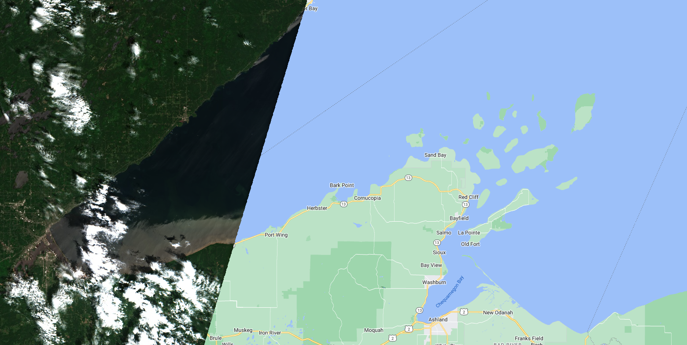
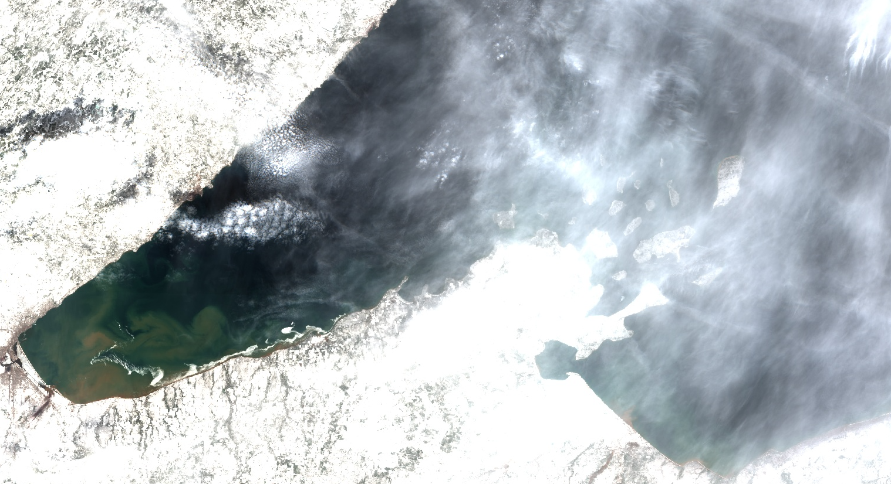

```{r setup, echo = F, message = FALSE}
# keep things quiet
knitr::opts_chunk$set(message = FALSE, error = FALSE, warning = FALSE, fig.dim = c(4,4))

# get all the functions from the src folder and load them
source_files <- list.files("src", full.names = T)
invisible(lapply(source_files, source))
# and the funcs for this analysis
analysis_funcs <- list.files("modeling/src", full.names = T)
invisible(lapply(analysis_funcs, source))
# list/load/download the packages needed for this script
packages <- c('rstatix',
              'tidyverse',
              'ggthemes',
              'GGally',
              'knitr')
invisible(lapply(packages, package_loader))
```

# Purpose

This script takes a deep dive into Sentinel 2 labels for a more rigorous
analysis of inconsistent band data and outliers in the filtered label dataset.
Here we will determine if any more label data points should be removed from the
training dataset and whether or not we can glean anything from the metadata in
the outlier dataset to be able to pre-emptively toss out scenes when we go to
apply the classification algorithm.

```{r}
harmonize_version = "2024-04-25"
outlier_version = "2024-04-25"

S2 <- read_rds(paste0("data/labels/harmonized_SEN2_labels_", harmonize_version, ".RDS"))
```

## Check for mis-matched band data between user data and re-pull

Just look at the data to see consistent (or inconsistent) user-pulled data and
our pull, here, our user data are in "BX" format and the re-pull is in "SR_BX"
format. These are steps to assure data quality if the volunteer didn't follow
the directions explicitly.

```{r}
pmap(.l = list(user_band = S2_user,
               ee_band = S2_ee,
               data = list(S2),
               mission = list("SENTINEL_2")),
     .f = make_band_comp_plot)
```

Handful of fliers here, we'll compare across the user-pulled and re-pulled data
for consistency.

```{r}
S2_inconsistent <- S2 %>% 
  filter(B2 != SR_B2 | B3 != SR_B3 | 
           B4 != SR_B4 | B5 != SR_B5 | B6 != SR_B6 | B7 != SR_B7 | 
           B11 != SR_B11 | B12 != SR_B12)

S2_inconsistent %>% 
  group_by(class) %>% 
  summarise(n_labels = n()) %>% 
  kable()
```

We should see if there is any common contributor or scene here. There were no
data handling differences between the user-pull and our second pull, so we can't
dismiss the cloud differences.

```{r}
S2_inconsistent %>% 
  group_by(vol_init) %>% 
  summarise(n_dates = length(unique(date)),
            n_labels = n()) %>% 
  kable()
```

The inconsistencies are spread across many dates, so I don't think there is any
special handling necessary here except for removing these from the dataset.

```{r}
S2_filtered <- S2 %>% 
  anti_join(S2_inconsistent) %>% 
  filter(# or where any re-pulled band value is greater than 1, which isn't a valid value
         if_all(S2_ee,
                ~ . <= 1))
```

And plot:

```{r, echo=FALSE}
pmap(.l = list(user_band = S2_user,
               ee_band = S2_ee,
               data = list(S2_filtered),
               mission = list("SENTINEL_2")),
     .f = make_band_comp_plot)
```

And now let's look at the data by class:

```{r, echo=FALSE}
pmap(.l = list(data = list(S2_filtered),
               data_name = list("SENTINEL_2"),
               band = S2_ee),
     .f = make_class_comp_plot)
```

We aren't actually modeling "other" (not sufficient observations to classify) or
"shorelineContamination" (we'll use this later to block areas where there is
likely shoreline contamination in the AOI). Additionally, "algalBloom" is likely
a processing issue, and n is too low to use that data, so we'll drop that class
as well. Finally, we'll drop the user band values since we're done with
comparisons.

```{r}
S2_for_class_analysis <- S2_filtered %>% 
  filter(!(class %in% c("other", "shorelineContamination", "algalBloom"))) %>% 
  select(-c(B2:B12))
```

```{r, echo=FALSE}
pmap(.l = list(data = list(S2_for_class_analysis),
               data_name = list("SENTINEL_2"),
               band = S2_ee),
     .f = make_class_comp_plot)
```

## Outlier handling

There are statistical outliers within this dataset and they may impact the
interpretation of any statistical testing we do. Let's see if we can narrow down
when those outliers and/or glean anything from the outlier data that may be
applicable to the the application of the algorithm. Outliers may be a systemic
issue (as in the scene is an outlier), it could be a user issue (a user may have
been a bad actor), or they just might be real. This section asks those
questions. The "true outliers" that we dismiss from the dataset will also be
used to help aid in interpretation/application of the algorithm across the
Landsat stack, so it is important to make notes of any patterns we might see in
the outlier dataset.

```{r, echo=FALSE}
vertical_data <- S2_for_class_analysis %>% 
  pivot_longer(S2_ee_all,
             names_to = "band_name",
             values_to = "value") %>% 
  rowid_to_column()
vert_out <- vertical_data %>% 
  select(user_label_id, rowid, date, class, band_name, value, vol_init) %>% 
  group_by(class, band_name) %>% 
  identify_outliers(., value) %>% 
  filter(is.extreme)
outliers <- vert_out  %>% 
  left_join(vertical_data) %>%
  select(-rowid)%>% 
  pivot_wider(names_from = band_name,
              values_from = value,
              values_fn = max)

print("Classes represented in outliers:")
unique(outliers$class)
```

Okay, `r nrow(outliers)` outliers (\>1.5\*IQR) out of
`r nrow(S2_for_class_analysis)` - and they are all from non-cloud groups.

How many of these outliers are in specific scenes?

```{r}
S2_out_date <- outliers %>% 
  group_by(date, vol_init) %>% 
  summarize(n_out = n())
S2_date <- S2_for_class_analysis %>% 
  filter(class != "cloud") %>% 
  group_by(date, vol_init) %>% 
  summarise(n_tot = n())
S2_out_date <- left_join(S2_out_date, S2_date) %>% 
  mutate(percent_outlier = n_out/n_tot*100) %>% 
  arrange(-percent_outlier)
S2_out_date %>% 
  kable()
```

There are two images with higher outliers, let's look at them quickly:

**2022-06-23**



There's some weird stuff happening here - while this does look like some near
shore sediment, I think there are also some aerosol issues with this scene. If
you zoom in on other waterbodies on this date, they have a similar grey-brown
sheen to them, and if you zoom in on this image, it doesn't look... natural?

**2023-04-11**



This is a really cool looking scene. Lots of things going on here: 1) the end of
ice break up 2) super hazy/cirrus clouds 3) snow on the ground might be affecting
the SR processes. We should probably ditch this scene, but we'll do that at the
end. 

### Tile-level metadata

Let's look at the tile-level metadata for the highest scenes here:

```{r}
S2_out_date %>% 
  filter(percent_outlier >= 20) %>% 
  select(date, vol_init) %>% 
  left_join(., S2) %>% 
  select(date, vol_init, GENERAL_QUALITY:RADIOMETRIC_QUALITY, 
         SNOW_ICE_PERCENTAGE_mean,
         SNOW_ICE_PERCENTAGE_max,
         SNOW_ICE_PERCENTAGE_min) %>% 
  distinct() %>% 
  kable()
```

Some detection of snow/ice in the April image, but since these are aggregated values 
across multiple tiles, hard to tell what to glean from this.

### Clouds

How many of these outliers have tile-level cloud metadata with high values?

```{r, echo = FALSE}
# cloudy pixel percentage
S2_out_mean_cloud <- outliers %>% 
  filter(CLOUDY_PIXEL_PERCENTAGE_mean > 60) 
# compared with the whole dataset 
S2_mean_cloud <- S2_for_class_analysis %>% 
  filter(class != "cloud" & CLOUDY_PIXEL_PERCENTAGE_mean > 60) 

# cirrus percentage
S2_out_mean_cirrus <- outliers %>% 
  filter(THIN_CIRRUS_PERCENTAGE_mean > 20) 
# compared with the whole dataset 
S2_mean_cirrus <- S2_for_class_analysis %>% 
  filter(class != "cloud" & THIN_CIRRUS_PERCENTAGE_mean > 20) 
```

The outlier dataset contains `r nrow(S2_out_mean_cloud)`
(`r round(nrow(S2_out_mean_cloud)/nrow(outliers)*100, 1)`%) where the mean pixel cloud
cover was \> 60% and `r nrow(S2_out_mean_cirrus)`
(`r round(nrow(S2_out_mean_cirrus)/nrow(outliers)*100, 1)`%) where the mean pixel cirrus
cover was \> 20%. The filtered dataset contains `r nrow(S2_mean_cloud)`
(`r round(nrow(S2_mean_cloud)/nrow(S2_for_class_analysis)*100, 1)`%) where the mean pixel cloud
cover was \> 60% and `r nrow(S2_mean_cirrus)`
(`r round(nrow(S2_mean_cirrus)/nrow(S2_for_class_analysis)*100, 1)`%) where the mean pixel cirrus
cover was \> 20%. This is a little more helpful than in Landsat images. Higher pixel
cloud cover and cirrus tend to be in outliers than in the filtered dataset.

### QA Pixels

Do any of the labels have QA pixel indications of opaque cloud or cirrus?

```{r}
S2_for_class_analysis %>% 
  mutate(QA = case_when(cirrus == 1 | cirrus_scl == 1 ~ "cirrus",
                        hi_prob_cloud == 1 | med_prob_cloud == 1 ~ "cloud",
                        snow_ice == 1 ~ "snow ice",
                        opaque == 1 ~ "opaque cloud",
                        cloud_shadow == 1 ~ "cloud shadow",
                        dark_pixel == 1 ~ "dark pix",
                        TRUE ~ "clear")) %>% 
  group_by(QA) %>% 
  filter(class != "cloud") %>% 
  summarize(n_tot = n()) %>% 
  kable()
```

Let's look at the cirrus and opaque cloud group to see if there is anything
egregious:

```{r}
S2_tot <- S2_for_class_analysis %>% 
  group_by(date, vol_init) %>% 
  summarise(n_tot_labels = n())
S2_for_class_analysis %>% 
  filter(cirrus == 1 | cirrus_scl == 1 | opaque == 1, 
         class != "cloud") %>% 
  group_by(date, vol_init) %>% 
  summarise(n_qa_flag = n()) %>% 
  left_join(S2_tot) %>%
  mutate(perc_qa_flag = round(n_qa_flag/n_tot_labels*100, 1)) %>% 
  arrange(-perc_qa_flag) %>% 
  kable()
```

The top tow images here are the same from the outlier analysis. I think we'll 
trust the QA bit to help with all this.

### Aerosol band

Sentinel 2 doesn't have an aerosol QA flag, but SR_B1 is aerosol, so we can look
at distributions to examine this. Let's look at the distribution across all data:

```{r}
S2_for_class_analysis %>% 
  ggplot(., aes(x = SR_B1)) +
  geom_histogram(binwidth = 0.01) +
  facet_grid(class ~ .) +
  theme_bw() +
  scale_x_continuous(breaks = seq(0, max(S2_for_class_analysis$SR_B1), 0.05))

B1_summary <- S2_for_class_analysis %>% 
  group_by(class) %>% 
  summarise(fifth_B1 = quantile(SR_B1, 0.05),
            mean_B1 = mean(SR_B1),
            ninetyfifth_B1 = quantile(SR_B1, 0.95))

kable(B1_summary)
```

Let's see how many of the oultiers have Rrs values higher than the 95th percentile
in their class:

```{r}
outliers %>% 
  left_join(B1_summary) %>% 
  filter(SR_B1 > ninetyfifth_B1, class != "cloud") %>% 
  nrow()
```

This is about 50% of the outliers, so a pretty decent QA measure.

### Training dataset implications

For the purposes of training data, we are going to throw out any labels that
have qa flags associated with them

```{r}
S2_training_labels <- S2_for_class_analysis %>% 
  filter(if_all(c("cirrus", "cirrus_scl", "cloud_shadow", 
                    "dark_pixel", "hi_prob_cloud", "med_prob_cloud",
                    "opaque", "snow_ice"),
                  ~ . == 0) |
           class == "cloud") %>% 
  filter(!(date %in% c("2022-06-23", "2023-04-11")))
  
```

Let's now see how many of these have high percentile SR_B1:

```{r}
S2_training_labels %>% 
  left_join(B1_summary) %>% 
  filter(SR_B1 > ninetyfifth_B1, class != "cloud") %>% 
  nrow()
```

And make sure none of them are concentrated in a specific scene:

```{r}
S2_training_labels %>% 
  left_join(B1_summary) %>% 
  filter(SR_B1 > ninetyfifth_B1, class != "cloud") %>% 
  group_by(date, vol_init) %>% 
  summarise(n_high_aero = n())
```

This seems totally reasonable. 

## Testing for inter-class differences

We do want to have an idea of how different the classes are, in regards to band
data. While there are a bunch of interactions that we could get into here, for
the sake of this analysis, we are going to analyze the class differences by
band.

Kruskal-Wallis assumptions:

1)  Data are non-Normal or have a skewed distribution
2)  There must be at least two independent groups.
3)  Data have a similar distribution across groups.
4)  Data are independent, the groups shouldn't have a relationship to one
    another
5)  Each group should contain at least 5 observations

ANOVA assumptions:

1)  data are distributed normally
2)  data have equal variances, if not equal variance perform Kruskal-Wallis
3)  data are independent
4)  variance across groups is similar

We can't entirely assert sample independence and we know that variance and
distribution is different for "cloud" labels, but those data also are visibly
different from the other classes.

In order to systematically test for differences between classes and be able to
interpret the data, we will need to know some things about our data:

1)  Are the data normally distributed (Shapiro-Wilkes)?
2)  Are there outliers that may impact interpretation?
3)  If data is non-normal, perform Kruskal-Wallis test; otherwise ANOVA if equal
variances, otherwise, back to Kruskal-Wallis
4)  if the null is rejected (and there is a difference in at least one class),
    perform post-hoc test for pairwise comparison (Dunn test for both)

With this workflow, most classes are statistically different - below are the
cases where the pairwise comparison were not deemed statistically significant:

```{r, echo = FALSE}
S2_band_sym = syms(S2_ee_all)

S2_class_analysis <- pmap(.l = list(dataset = list(S2_training_labels),
                                     bnd = S2_band_sym,
                                     class_col = list(sym("class"))),
                           .f = test_class_sig)
names(S2_class_analysis) <- S2_band_sym

map(S2_class_analysis,
    function(band) {
      band$pairwise_difference %>% 
        filter(p.adj.signif == "ns")
    }
  ) %>% 
  list_rbind() %>% 
  rename(band = .y.) %>% 
  kable()
```

Eep, this isn't great, but the pairwise confusion seems concentrated in dark 
near shore sediment. 

Let's look at the boxplots of the non-cloud classes:

```{r}
S2_training_labels_no_clouds <- S2_training_labels %>% 
  filter(class != "cloud")
pmap(.l = list(data = list(S2_training_labels_no_clouds),
               data_name = list("SENTINEL_2"),
               band = S2_ee_all),
     .f = make_class_comp_plot)
```

This actually makes me feel a little better. I think there might be enough here
for ML to differentiate between classes. 

There are `r nrow(S2_class_analysis$SR_B1$outliers)` in SR_B1, `r nrow(S2_class_analysis$SR_B2$outliers)` in SR_B2, `r nrow(S2_class_analysis$SR_B3$outliers)` in SR_B3, `r nrow(S2_class_analysis$SR_B4$outliers)` in SR_B4, `r nrow(S2_class_analysis$SR_B5$outliers)` in SR_B5, `r nrow(S2_class_analysis$SR_B6$outliers)` outliers in SR_B6, `r nrow(S2_class_analysis$SR_B7$outliers)` in SR_B7, `r nrow(S2_class_analysis$SR_B8$outliers)` in SR_B8, `r nrow(S2_class_analysis$SR_B8A$outliers)` in SR_B8A, `r nrow(S2_class_analysis$SR_B11$outliers)` in SR_B11, and `r nrow(S2_class_analysis$SR_B12$outliers)` in SR_B12.


```{r, echo=FALSE, fig.dim=c(10,10), fig.cap="DNSS: dark near shore sediment, LNSS: light near shore sediment, OSS: offshore sediment"}
S2_training_labels %>% 
  mutate(class_short = case_when(class == "darkNearShoreSediment" ~ "DNSS",
                                 class == "lightNearShoreSediment" ~ "LNSS",
                                 class == "offShoreSediment" ~ "OSS",
                                 TRUE ~ class)) %>% 
ggpairs(., columns = S2_ee_all, aes(color = class_short)) + 
  scale_color_colorblind() +
  scale_fill_colorblind() +
  theme_few()
```

Let's zoom in on the sediment
classes.

```{r, echo=FALSE, fig.dim=c(8,8), fig.cap="DNSS: dark near shore sediment, LNSS: light near shore sediment, OSS: offshore sediment"}
S2_training_labels %>% 
  mutate(class_short = case_when(class == "darkNearShoreSediment" ~ "DNSS",
                                 class == "lightNearShoreSediment" ~ "LNSS",
                                 class == "offShoreSediment" ~ "OSS",
                                 TRUE ~ class)) %>% 
  filter(grepl("Sediment", class) | class == "openWater") %>% 
ggpairs(., columns = S2_ee_all, aes(color = class_short)) + 
  scale_color_colorblind() +
  scale_fill_colorblind() +
  theme_few()
```

### Aggregating sediment classes and performing statistical tests

As a back up, we should consider using aggregated sediment classes, where any 
label of sediment is treated as a general class of "sediment". Let's do the same 
process here to test for class significance.

```{r, echo = FALSE}
S2_training_labels <- S2_training_labels %>% 
  mutate(agg_class = if_else(grepl("Sediment", class),
                             "sediment",
                             class))

S2_class_analysis_aggregated <- pmap(.l = list(dataset = list(S2_training_labels),
                                     bnd = S2_band_sym,
                                     class_col = list(sym("agg_class"))),
                           .f = test_class_sig)
names(S2_class_analysis_aggregated) <- S2_band_sym

map(S2_class_analysis_aggregated,
    function(band) {
      band$pairwise_difference %>% 
        filter(p.adj.signif == "ns")
    }
  ) %>% 
  list_rbind() %>% 
  rename(band = .y.)
```

And let's look at the scatter plots here:

```{r, echo=FALSE, fig.dim=c(10,10)}
S2_training_labels %>% 
ggpairs(., columns = S2_ee_all, aes(color = agg_class)) + 
  scale_color_colorblind() +
  scale_fill_colorblind() +
  theme_few()
```

And if we drop the cloud:

```{r}
S2_training_labels %>% 
  filter(agg_class != "cloud") %>% 
ggpairs(., columns = S2_ee_all, aes(color = agg_class)) + 
  scale_color_colorblind() +
  scale_fill_colorblind() +
  theme_few()
```

## Export the training labels

Things to note for Sentinel 2:

-   any QA flagged pixel should be dissmissed before applying the algorithm
-   SR_B1 values greater than 0.04 for open water and dark near shore sediment, 
    0.05 for offshore sediment, and 0.08 for light near shore sediment may have more
    uncertainty associated with their labels. 
-   bright cloud cover and snow may impact Rrs within the waterbody leading to
    outliers. will need to be cautious applying the algo when snow is on the
    ground - might consider filtering out tiles with high (>10%) snow/ice cover
-   higher concentrations of cirrus clouds (via tile metadata) and cloud cover
    may merit additional uncertainty

```{r}
write_rds(S2_training_labels, paste0("data/labels/S2_labels_for_tvt_", outlier_version, ".RDS"))
```
